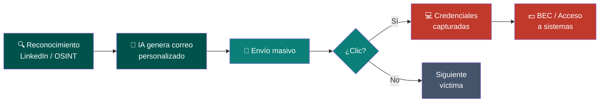
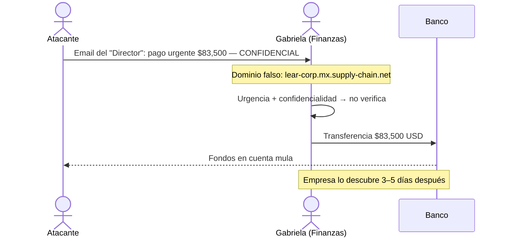
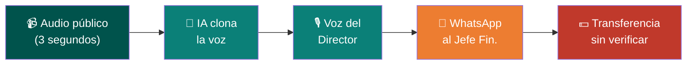
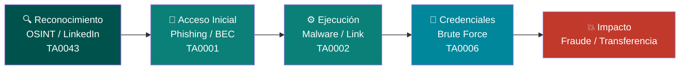
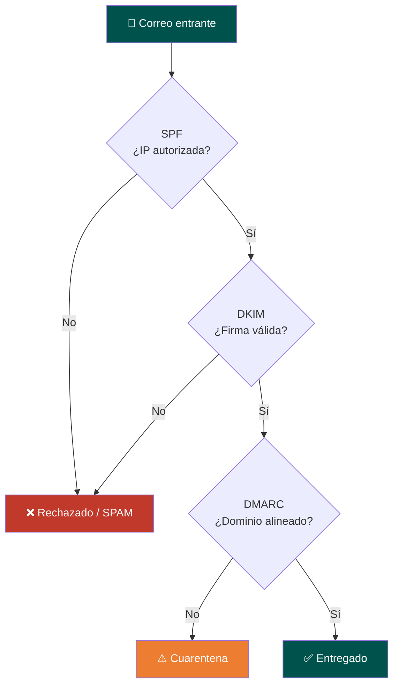

<div class="absolute right-0 top-0 bottom-0 w-[42%] bg-[#00879B]/92 flex flex-col justify-center pl-8 pr-6 z-10 overflow-hidden">
  <h1 class="text-white text-2xl font-light leading-tight mb-3 pb-3" style="border-bottom: 2px solid #40C6BD; border-color: #40C6BD !important;">
    Ciberseguridad<br/>para la Industria<br/>Manufacturera
  </h1>
  <h2 class="text-[#B1DFDC] text-base font-light mb-5">
    Día 1 — Amenazas Emergentes<br/>con IA e Ingeniería Social
  </h2>
  <p class="text-white/90 text-sm font-semibold">INDEX Ciudad Juárez</p>
  <p class="text-white/60 text-xs mt-1">24 de marzo de 2026 · Sesión 1 de 4</p>
</div>

<!--
Bienvenida al curso. Presentarse. Preguntar: ¿alguien ha recibido un correo sospechoso en su trabajo?
-->

---
layout: quote
---

# "El eslabón más débil de la cadena de seguridad siempre ha sido el humano."

**Kevin Mitnick — ex hacker más buscado del FBI, consultor de seguridad**

<!--
Esto es la esencia del día de hoy. La tecnología puede ser perfecta, pero basta una persona engañada.
-->

---
layout: center
---

# Antes de empezar...

<Poll question="¿Has recibido un correo sospechoso en tu trabajo?" :answers="['Sí, y lo reporté', 'Sí, pero no hice nada', 'No que yo sepa', 'No tenemos forma de saberlo']" />

<!--
Dejar 60 segundos para que voten. Usar los resultados para contextualizar el día.
-->

---
layout: two-cols-header
---

# Agenda del Día 1

::left::

| Bloque | Tema |
|--------|------|
| <carbon-security class="text-blue-600" /> Bloque 1 | Panorama de amenazas |
| <carbon-email class="text-blue-600" /> Lab 1 | Análisis de phishing |
| <ph-mask-happy class="text-purple-600" /> Lab 2 | Detección de deepfakes |
| <carbon-enterprise class="text-amber-600" /> Ejercicio | Simulación BEC |

::right::

**Al terminar hoy podrás:**

<v-clicks>

- Identificar correos de phishing generados con IA
- Detectar señales de deepfake en audio y video
- Analizar un ataque BEC real
- Proponer controles para tu planta

</v-clicks>

---
layout: center
---

# ¿Cómo está tu planta hoy?

<div class="grid grid-cols-3 gap-4 mt-4 text-center text-sm">

<div class="border-2 border-red-300 rounded-xl p-4 bg-red-50">
  <div class="text-3xl mb-2">🌡️</div>
  <div class="text-red-700 font-bold text-base mb-2">Riesgo Alto</div>
  <div class="text-red-600 text-xs space-y-1">
    <div>Sin capacitación en phishing</div>
    <div>Sin DMARC configurado</div>
    <div>Sin protocolo de transferencias</div>
    <div>Sin MFA en correo</div>
  </div>
</div>

<div class="border-2 border-amber-300 rounded-xl p-4 bg-amber-50">
  <div class="text-3xl mb-2">⚠️</div>
  <div class="text-amber-700 font-bold text-base mb-2">Riesgo Medio</div>
  <div class="text-amber-600 text-xs space-y-1">
    <div>Capacitación anual solamente</div>
    <div>DMARC en modo monitor</div>
    <div>Aprobación informal de pagos</div>
    <div>MFA solo en algunos sistemas</div>
  </div>
</div>

<div class="border-2 border-green-300 rounded-xl p-4 bg-green-50">
  <div class="text-3xl mb-2">✅</div>
  <div class="text-green-700 font-bold text-base mb-2">Riesgo Bajo</div>
  <div class="text-green-600 text-xs space-y-1">
    <div>Simulaciones mensuales de phishing</div>
    <div>DMARC en enforce (p=reject)</div>
    <div>Protocolo formal de doble aprobación</div>
    <div>MFA en todos los accesos críticos</div>
  </div>
</div>

</div>

<div class="tip-teal text-sm mt-4 text-center">
  <carbon-information class="text-teal-700" /> Al final del día, este termómetro debería verse diferente. Guarda mentalmente en qué columna está tu planta <strong>hoy</strong>.
</div>

<!--
Pedir que levanten la mano: ¿quién está en rojo? ¿amarillo? ¿verde? No hay respuestas incorrectas, es diagnóstico honesto.
-->

---
layout: section
---

# Bloque 1
## Panorama de amenazas en la industria maquiladora

---
layout: image-right
image: /images/manufacturing-plant.jpg
---

# ¿Por qué Juárez es un objetivo?

**+300 plantas con clientes Fortune 500**

| Empresa | Giro |
|---------|------|
| Foxconn | Electrónica |
| Lear | Arneses automotrices |
| Delphi | Componentes eléctricos |
| Honeywell | Aeroespacial |
| Bosch | Autopartes |

**Lo que quieren los atacantes:**

<v-clicks>

- <carbon-currency-dollar class="text-green-600" /> Transferencias USD ↔ MXN frecuentes
- <carbon-tools class="text-amber-600" /> Propiedad intelectual de clientes globales
- <carbon-link class="text-blue-600" /> Proveedores locales con seguridad débil
- <carbon-email class="text-blue-600" /> Comunicación constante entre fronteras

</v-clicks>

<div class="absolute bottom-4 left-8 text-xs text-gray-500">
  <carbon-link class="text-gray-500" /> <a href="https://www.tecma.com/ciudad-juarez-mexico-is-home-to-mexican-industries/" target="_blank">Tecma Group — 70 Fortune 500 facilities, 255,000 trabajadores directos en Juárez</a>
</div>

<!--
Preguntar al grupo: ¿con cuántos proveedores interactúan por correo cada semana?
-->

---
layout: two-cols
---

# La evolución del phishing

## <carbon-time class="text-gray-500" /> Antes (2015–2020)

<v-clicks>

- Correos masivos con errores ortográficos obvios
- Dominios genéricos: `seguridad-bancaria.tk`
- Tono genérico, sin datos personales
- Fácil de identificar a simple vista
- **Tasa de éxito:** ~3%

</v-clicks>

::right::

## <carbon-watson-machine-learning class="text-red-600" /> Ahora con IA (2024–2026)

<v-clicks>

- **Personalizado** con datos de LinkedIn de la víctima
- **Sin errores** — español mexicano perfecto
- Imita el tono exacto del ejecutivo real
- **Automatizado** — miles de correos en minutos
- **Tasa de éxito:** hasta 30%

</v-clicks>

<v-click>

<div class="mt-3 p-2 rounded text-sm tip-danger">
  <carbon-warning class="text-red-600" /> La IA analiza el estilo de escritura de un gerente en segundos y lo replica.
</div>

</v-click>

<div class="absolute bottom-4 left-8 text-xs text-gray-500">
  <carbon-link class="text-gray-500" /> <a href="https://www.ibm.com/think/insights/generative-ai-social-engineering" target="_blank">IBM X-Force — IA genera correo de phishing en 5 min vs 16h humanas (2025)</a>
</div>

---

# Anatomía del ataque de phishing con IA

<Transform :scale="0.92">



</Transform>

<!--
Señalar que el paso B (IA genera correo) antes tardaba horas por un humano. Ahora son segundos y a escala masiva.
-->

---
layout: fact
background: /images/bec-fraud-money.jpg
---

# $55 mil millones USD

## Pérdidas globales por BEC (2013–2023)

*Fuente: FBI Internet Crime Complaint Center*

<div class="absolute bottom-4 left-8 text-xs text-gray-400">
  <carbon-link class="text-gray-500" /> <a href="https://www.ic3.gov/PSA/2024/PSA240911" target="_blank">FBI IC3 PSA240911 — Business Email Compromise: The $55 Billion Scam (Oct 2013–Dic 2023)</a>
</div>

<!--
Este número es solo los casos reportados. El real es mucho mayor.
-->

---

# ¿Qué es MITRE ATT&CK?

<div class="grid grid-cols-2 gap-6 mt-2">

<div>

**MITRE ATT&CK** es una **base de datos pública** que documenta cómo los hackers atacan realmente a las organizaciones — qué pasos siguen, qué herramientas usan y cómo los detectamos.

<div class="tip-teal text-sm mt-3">
  <carbon-information class="text-teal-700" /> Es como un <strong>manual de tácticas de los atacantes</strong>, escrito por investigadores que analizan ataques reales en todo el mundo.
</div>

**¿Para qué sirve en tu planta?**

<v-clicks>

- Identificar qué ataques son más probables en maquiladoras
- Saber exactamente en qué paso está un ataque en curso
- Hablar el mismo idioma que IT Security y proveedores externos

</v-clicks>

</div>

<div>

<div class="border border-[#B1DFDC] rounded-lg overflow-hidden text-sm">
  <div class="bg-[#00534C] text-white px-4 py-2 font-semibold text-xs">
    MITRE ATT&CK — attack.mitre.org
  </div>
  <div class="px-4 py-3 space-y-2 bg-white">
    <div class="flex items-start gap-2">
      <span class="bg-[#40C6BD] text-white rounded px-1.5 py-0.5 text-xs font-bold shrink-0">+14</span>
      <span class="text-xs text-gray-700"><strong>Tácticas</strong> — el objetivo del atacante (ej. robar credenciales)</span>
    </div>
    <div class="flex items-start gap-2">
      <span class="bg-[#00879B] text-white rounded px-1.5 py-0.5 text-xs font-bold shrink-0">+200</span>
      <span class="text-xs text-gray-700"><strong>Técnicas</strong> — cómo logra ese objetivo (ej. phishing)</span>
    </div>
    <div class="flex items-start gap-2">
      <span class="bg-[#0B8078] text-white rounded px-1.5 py-0.5 text-xs font-bold shrink-0">+400</span>
      <span class="text-xs text-gray-700"><strong>Subtécnicas</strong> — variante específica (ej. spear phishing por link)</span>
    </div>
    <div class="flex items-start gap-2">
      <span class="bg-[#00534C] text-white rounded px-1.5 py-0.5 text-xs font-bold shrink-0">130+</span>
      <span class="text-xs text-gray-700"><strong>Grupos APT</strong> — bandas criminales documentadas</span>
    </div>
  </div>
</div>

</div>

</div>

---
layout: two-cols-header
---

# MITRE ATT&CK — Términos que escucharás hoy

::left::

| Término | Significa | Ejemplo real |
|---------|-----------|--------------|
| **Táctica** | El *objetivo* del ataque | Obtener acceso inicial |
| **Técnica** | El *método* usado | T1566 — Phishing |
| **Subtécnica** | Variante específica | T1566.001 — Link malicioso |
| **IOC** | Evidencia del ataque | IP sospechosa, hash de archivo |
| **APT** | Grupo hacker organizado | Lazarus Group (Corea del Norte) |
| **TTP** | Tácticas + Técnicas + Procedimientos | El "manual" de un grupo específico |

::right::

## En este curso usamos ATT&CK para:

<v-clicks>

- <carbon-search class="text-blue-600" /> **Identificar** qué técnica usó el atacante en cada ejemplo
- <carbon-security class="text-green-600" /> **Mapear** controles CIS a técnicas específicas
- <carbon-report class="text-purple-600" /> **Reportar** incidentes con lenguaje estándar internacional

</v-clicks>

<v-click>

<div class="tip-teal text-sm mt-4">
  <carbon-idea class="text-teal-700" /> <strong>Ejemplo:</strong> El correo de "Carlos Mendoza" de Lear usa <strong>T1566.001</strong> (Spear Phishing — Link). Ese código lo encontrarás en reportes de seguridad de cualquier país.
</div>

</v-click>

---
layout: center
---

# ¿Tu empresa está protegida?

<Poll question="¿Tu dominio corporativo tiene DMARC configurado?" :answers="['Sí, con política enforce (p=reject)', 'Sí, pero en modo monitor (p=none)', 'No lo tenemos', 'No sé qué es DMARC']" />

<!--
85.7% de los dominios del top 1M no tienen DMARC efectivo. Usar los resultados para validar el punto.
-->

---

# Ejemplo real — Phishing en planta de arneses

<div class="border border-gray-300 rounded-lg overflow-hidden text-sm my-2">
  <div class="bg-[#00534C] text-white px-3 py-1.5 text-xs flex items-center gap-2">
    <carbon-email class="text-[#40C6BD]" /> Correo corporativo — Outlook
  </div>
  <div class="bg-[#fff8f0] border-b border-[#ED7D31] px-3 py-1.5 text-xs text-[#7C3912] font-bold">
    ⚠ Remitente externo — Verificar antes de actuar
  </div>
  <div class="bg-white px-3 py-2">
    <div class="text-xs text-gray-500 mb-1"><strong>De:</strong> <code>carlos.mendoza@lear-corp.mx.supply-chain.net</code></div>
    <div class="text-xs text-gray-500 mb-1"><strong>Para:</strong> <code>Accounts.Payable@lear.com.mx</code></div>
    <div class="text-xs text-gray-500 mb-2 pb-2 border-b border-gray-200"><strong>Asunto:</strong> RE: Pago urgente — Proveedor estratégico — CONFIDENCIAL</div>
    <p class="text-xs text-gray-700 italic">"Gabriela, por instrucciones del VP de Finanzas en Detroit necesitamos confirmar transferencia urgente de <strong>$47,000 USD</strong> al proveedor Autopartes del Norte antes del cierre de mes. Es confidencial — no comentar con nadie de compras."</p>
  </div>
</div>

**Señales de alerta:**

<v-clicks>

1. <carbon-alarm class="text-red-600" /> Dominio falso: `.mx.supply-chain.net` en lugar de `lear.com`
2. <carbon-time class="text-orange-600" /> Urgencia artificial — "cierre de mes"
3. <carbon-view-off class="text-purple-600" /> Confidencialidad para **evitar verificación**
4. <carbon-money class="text-green-600" /> Datos bancarios "por separado" fuera del sistema

</v-clicks>

---
layout: two-cols
---

# BEC — Variantes en maquiladoras

| Variante | Ejemplo en Juárez |
|----------|-------------------|
| **Fraude de CEO** | "Director" desde aeropuerto pide transferencia |
| **Fraude de proveedor** | "Autopartes Visión" cambia cuenta bancaria |
| **Fraude de nómina** | Empleado "solicita" cambio de CLABE |
| **Fraude de abogado** | Demanda urgente con pago inmediato |

::right::

**¿Por qué funciona?**

<v-clicks>

- Usa nombres y datos reales de LinkedIn
- Imita el tono exacto del ejecutivo
- Aprovecha presión de tiempo
- Pide confidencialidad para aislar a la víctima
- El correo llega de una cuenta comprometida real

</v-clicks>

---

# ¿Por qué funciona el BEC? — Ingeniería social

<Transform :scale="0.88">

```rough-mermaid
flowchart LR
    A["Autoridad\nCorreo del Director"] --> B["Urgencia\nAntes de las 3 PM"]
    B --> C["Confidencialidad\nNo lo menciones a compras"]
    C --> D["Aislamiento\nVíctima actúa sola"]
    D --> E["Acción sin verificar\nTransferencia procesada"]
```

</Transform>

> Cada elemento por separado parece razonable. Juntos, crean una trampa casi perfecta.

---

# Secuencia completa de un ataque BEC

<Transform :scale="0.82">



</Transform>

<div class="absolute bottom-4 left-8 text-xs text-gray-500">
  <carbon-link class="text-gray-500" /> <a href="https://therecord.media/mexican-companies-targeted-by-financially-motivated-hackers" target="_blank">The Record — Campaña AllaKore RAT dirigida a grandes empresas manufactureras en México</a> ·
  <a href="https://www.crisis24.com/articles/mexico-cyber-crimes-likely-to-escalate-threatening-national-security-and-financial-interests" target="_blank">Crisis24 — México absorbe ~55% de ciberataques en LATAM (2024)</a>
</div>

<!--
Preguntar: ¿En qué paso hubiera fallado el ataque si existiera un protocolo de verificación?
-->

---
layout: two-cols-header
---

# Clonación de voz con IA


::left::

## El ataque

Con **solo 3 segundos de audio** la IA clona cualquier voz.

**¿De dónde obtienen el audio?**
- Videos de LinkedIn del director
- Presentaciones en YouTube
- Videos corporativos en redes sociales

**Flujo del ataque:**

<Transform :scale="0.78">



</Transform>

::right::

## Protocolo de verificación

<v-clicks>

1. <carbon-phone class="text-green-600" /> Llamar al número **conocido** de la persona
2. <carbon-help class="text-amber-600" /> Hacer pregunta que solo ella podría responder
3. <carbon-alarm class="text-red-600" /> Nunca procesar pagos urgentes por audio/WhatsApp
4. <carbon-document class="text-blue-600" /> Todo pago requiere ticket en sistema

</v-clicks>

---
layout: image-right
image: /images/deepfake-face-scan.jpg
---

# Deepfakes en videollamadas — Cómo detectarlos

**Ya es posible reemplazar un rostro en tiempo real en Teams/Zoom**

<v-clicks>

**Señales en video:**
- Bordes **borrosos** alrededor del cabello y orejas
- **Parpadeo anormal** — menos de 15 veces por minuto
- Sombras del rostro **no corresponden** al fondo
- **Pixelación** al girar la cabeza
- Boca **desincronizada** con el audio

**Protocolo ante llamada sospechosa:**
1. Pedir que mueva la cabeza lentamente de lado a lado
2. Hacer pregunta personal espontánea
3. Continuar por teléfono (línea diferente)

</v-clicks>

<div class="absolute bottom-4 left-8 text-xs text-gray-500">
  <carbon-link class="text-gray-500" /> <a href="https://www.trendmicro.com/en_us/research/24/b/deepfake-video-calls.html" target="_blank">Trend Micro — $25M robados con deepfake de CFO (Hong Kong, 2024)</a>
</div>

---

# Ataques a cadena de suministro en Juárez


```rough-mermaid
flowchart LR
    A[Atacante] -->|Compromete correo| B[Proveedor local\nde mantenimiento]
    B -->|Factura falsa o malware| C[Planta maquiladora]
    C -->|Confía en remitente conocido| D[Sistema comprometido]
```

**Sectores más vulnerables en Juárez:**

<v-clicks>

- <carbon-delivery-truck class="text-blue-600" /> Empresas de transporte/logística (frontera EE.UU.–México)
- <carbon-tools class="text-amber-600" /> Proveedores de mantenimiento con acceso físico a planta
- <carbon-package class="text-orange-600" /> Agencias aduanales con datos de importación
- <carbon-industry class="text-gray-500" /> Maquiladoras medianas proveedoras de Tier 1 automotriz

</v-clicks>

<div class="absolute bottom-4 left-8 text-xs text-gray-500">
  <carbon-link class="text-gray-500" /> <a href="https://www.cisa.gov/resources-tools/resources/critical-manufacturing-sector-supply-chain-security-and-gray-market" target="_blank">CISA — Critical Manufacturing Sector: Supply Chain Security</a> ·
  <a href="https://www.verizon.com/about/news/feed/2024-data-breach-investigations-report-vulnerability-exploitation-boom" target="_blank">Verizon DBIR 2024 — Third-party involvement in breaches up 68%</a>
</div>

---

# Kill Chain — MITRE ATT&CK · Día 1

<Transform :scale="0.9">



</Transform>

<!--
Conectar cada nodo con los ejemplos del día: el correo de Lear (T1566), la descarga del keylogger (T1204), las credenciales de SAP robadas (T1110).
-->

---
layout: two-cols
---

# MITRE ATT&CK — Día 1

| ID | Táctica | Técnica |
|----|---------|---------|
| TA0043 | Reconnaissance | T1591 — Gather Victim Info |
| TA0001 | Initial Access | T1566 — Phishing |
| TA0001 | Initial Access | T1566.001 — Spear Phishing Link |
| TA0001 | Initial Access | T1566.002 — Phishing Attachment |
| TA0006 | Credential Access | T1110 — Brute Force |

::right::

# CIS Controls

**Control 14 — Security Awareness**
- Simulaciones de phishing mensuales
- Capacitación específica por área

**Control 9 — Email Protection**
- DMARC + DKIM + SPF en dominio
- Filtro antiphishing en gateway

**Control 5 — Account Management**
- Doble aprobación para transferencias grandes
- Verificación de cambios bancarios

---
layout: two-cols-header
---

# Métricas de seguridad — Día 1

::left::

## Phishing Click Rate

```
Click Rate = (Clics / Total usuarios) × 100
```

| Nivel | Valor | Acción |
|-------|-------|--------|
| <carbon-warning-filled class="text-red-500" /> Alto riesgo | > 15% | Capacitación urgente |
| <carbon-warning-alt-filled class="text-yellow-500" /> Moderado | 5–15% | Reforzar mensual |
| <carbon-checkmark-filled class="text-green-500" /> Aceptable | < 5% | Mantener programa |

::right::

## Security Awareness Coverage

```
Cobertura = (Capacitados / Total) × 100
```

**Meta:** ≥ **90%** de empleados

<div class="mt-4 p-3 rounded text-sm tip-warn">

<carbon-warning-filled class="text-orange-600" /> Sin programa de concientización, las maquiladoras promedian **22–35%** de click rate.

</div>

---
layout: two-cols-header
---

# Dashboard de seguridad — ¿Cómo está tu planta hoy?

::left::

## <carbon-email class="text-blue-600" /> Phishing Click Rate

| Estado | Valor | Tu planta |
|--------|-------|-----------|
| <carbon-warning-filled class="text-red-500" /> Crítico | > 15% | ← Promedio sin programa |
| <carbon-warning-alt-filled class="text-yellow-500" /> Riesgo | 5–15% | |
| <carbon-checkmark-filled class="text-green-500" /> Meta | < 5% | ← Objetivo |

<div class="mt-3 p-2 rounded text-sm tip-danger">
  Maquiladoras sin capacitación: <strong>22–35%</strong> de click rate promedio
</div>

::right::

## <carbon-security class="text-blue-600" /> Security Awareness Coverage

| Estado | Valor | Tu planta |
|--------|-------|-----------|
| <carbon-warning-filled class="text-red-500" /> Crítico | < 50% | ← Sin programa |
| <carbon-warning-alt-filled class="text-yellow-500" /> Riesgo | 50–89% | |
| <carbon-checkmark-filled class="text-green-500" /> Meta | ≥ 90% | ← Objetivo |

<div class="mt-3 p-2 rounded text-sm tip-teal">
  <carbon-information class="text-teal-700" /> Herramienta gratuita: <strong>GoPhish</strong> — simula phishing y mide ambas métricas
</div>

---

# ✅ Cierre — Bloque 1

<div class="grid grid-cols-3 gap-5 mt-4">

<div class="tip-teal p-4 rounded-xl text-center">
  <div class="text-2xl mb-2">🎣</div>
  <div class="text-[#00534C] font-bold mb-1">El phishing con IA</div>
  <div class="text-xs text-gray-600">Ya no tiene errores ortográficos. Se personaliza con LinkedIn. El 91% de los ataques empieza aquí.</div>
</div>

<div class="tip-warn p-4 rounded-xl text-center">
  <div class="text-2xl mb-2">🎭</div>
  <div class="text-[#7C3912] font-bold mb-1">Deepfakes y clonación de voz</div>
  <div class="text-xs text-gray-600">Un audio de 3 segundos basta para clonar la voz de tu director. Ya ocurrió en México en 2024.</div>
</div>

<div class="tip-danger p-4 rounded-xl text-center">
  <div class="text-2xl mb-2">💸</div>
  <div class="text-red-700 font-bold mb-1">BEC en maquiladoras</div>
  <div class="text-xs text-gray-600">$55 mil millones en pérdidas globales. Juárez es objetivo directo por sus transferencias USD↔MXN.</div>
</div>

</div>

<v-click>

<div class="mt-4 p-3 bg-[#00534C] text-white rounded-xl text-sm text-center">
  <strong>Pregunta para llevar al lab:</strong> ¿Podrías detectar un correo de phishing generado por IA dirigido específicamente a ti?
</div>

</v-click>

---
layout: center
---

<Poll question="Antes del lab: ¿qué tan seguros estás de detectar un correo phishing con IA?" :answers="['Muy seguro — lo detecto siempre', 'Bastante seguro — casi siempre', 'No muy seguro — a veces me confundo', 'Nada seguro — no sé cómo detectarlos']" />

<!--
Guardar estos resultados. Al final del lab, preguntar de nuevo informalmente si cambió su percepción.
-->

---
layout: section
background: /images/tecmilenio-laptop.png
---

# Lab 1
## Análisis de phishing con TryHackMe

<div class="flex flex-col gap-3 mt-3">

<div class="grid grid-cols-4 gap-2 text-xs text-center">
  <div class="bg-white/20 rounded-lg p-2"><div class="text-xl">⏱️</div><div class="font-bold">45 min</div></div>
  <div class="bg-white/20 rounded-lg p-2"><div class="text-xl">🔍</div><div class="font-bold">Analista</div><div class="opacity-80 text-xs">cabeceras</div></div>
  <div class="bg-white/20 rounded-lg p-2"><div class="text-xl">🛡️</div><div class="font-bold">Defensor</div><div class="opacity-80 text-xs">controles</div></div>
  <div class="bg-white/20 rounded-lg p-2"><div class="text-xl">📋</div><div class="font-bold">Documentador</div><div class="opacity-80 text-xs">hallazgos</div></div>
</div>

<div class="flex items-center gap-6">
<div>

<carbon-link class="text-blue-600" /> **tryhackme.com** · Sala: "Phishing Emails in Action"

1. Crear cuenta gratuita en TryHackMe
2. Buscar sala: **Phishing Emails in Action**
3. Completar niveles 1–4 (45 min)

</div>
<QRCode
  :width="160"
  :height="160"
  type="svg"
  data="https://tryhackme.com/room/phishingemails1tryoe"
  :margin="8"
  :dotsOptions="{ type: 'extra-rounded', color: '#00534C' }"
  :backgroundOptions="{ color: '#FFFFFF' }"
/>
</div>
</div>

---

# Lab 1 — Análisis de cabeceras de correo

**Cabecera sospechosa — Identifica las anomalías:**

```text {all|1|2|3|4}
From:      rrhh@lear.com.mx-notificaciones.net
Reply-To:  pagos.urgentes@gmail.com
X-Originating-IP: 185.220.101.45
Received:  from mail.bulkmailer.ru
Subject:   Actualización urgente — Nómina Abril
```

<v-clicks>

1. **From:** Dominio falso — `.mx-notificaciones.net` en lugar de `lear.com`
2. **Reply-To:** ¿Por qué Gmail? El atacante recibiría la respuesta aquí
3. **IP:** `185.220.101.45` es un nodo Tor de salida en Europa
4. **Received:** `mail.bulkmailer.ru` — servidor masivo de spam en Rusia

</v-clicks>

<!--
Meta: que los participantes identifiquen al menos 3 de las 4 señales en cada correo que se analiza.
-->

---

# Lab 1 — Verificación de dominios

**Herramientas a usar:**

| Herramienta | URL | Para qué |
|-------------|-----|---------|
| MXToolbox | `mxtoolbox.com` | Verificar SPF, DKIM, DMARC |
| WHOIS | `whois.domaintools.com` | Fecha de registro del dominio |

**Dominios simulados a analizar:**

<v-clicks>

- `lear-corporation-mx.com` → Registrado hace 3 días. Sin DMARC.
- `foxconn-pagos.net` → Registrado en Panamá. Sin relación con Foxconn.
- `bosch-proveedores.mx` → Registrado hace 1 semana. Sin registros MX válidos.

</v-clicks>

<v-click>

> **Regla de oro:** Un dominio registrado hace menos de 30 días enviando correos urgentes de pagos = alerta máxima.

</v-click>

---
layout: two-cols
---

# Lab 1 — Cómo protege DMARC tu dominio

::left::

<Transform :scale="0.88">



</Transform>

::right::

<div class="flex flex-col justify-center h-full gap-4 pl-4">

> Sin DMARC, cualquier atacante puede enviar correos **desde tu dominio** y el destinatario los recibirá como legítimos.

<div class="tip-danger text-sm">
  <carbon-warning class="text-red-600" /> Solo el <strong>33%</strong> del Top 1M de dominios tiene DMARC válido
</div>

<div class="tip-teal text-sm">
  <carbon-checkmark class="text-teal-700" /> Herramienta gratuita: <strong>mxtoolbox.com</strong> para verificar tu dominio ahora
</div>

</div>

---
layout: section
background: /images/tecmilenio-videocall.jpeg
---

# Lab 2
## Detección de deepfakes · 45 minutos

<div class="flex flex-col gap-3 mt-3">

<div class="grid grid-cols-4 gap-2 text-xs text-center">
  <div class="bg-white/20 rounded-lg p-2"><div class="text-xl">⏱️</div><div class="font-bold">45 min</div></div>
  <div class="bg-white/20 rounded-lg p-2"><div class="text-xl">🎯</div><div class="font-bold">Analista</div><div class="opacity-80 text-xs">detecta señales</div></div>
  <div class="bg-white/20 rounded-lg p-2"><div class="text-xl">📞</div><div class="font-bold">Verificador</div><div class="opacity-80 text-xs">protocolo</div></div>
  <div class="bg-white/20 rounded-lg p-2"><div class="text-xl">🎤</div><div class="font-bold">Presentador</div><div class="opacity-80 text-xs">expone caso</div></div>
</div>

<div class="flex items-center gap-6">
<div>

Herramientas de detección gratuitas:

- <carbon-link class="text-blue-600" /> **FakeCatcher** — Intel (demo online)
- <carbon-link class="text-blue-600" /> **Deepware Scanner** — deepware.ai
- <carbon-link class="text-blue-600" /> **Hive Moderation** — hivemoderation.com

</div>
<QRCode
  :width="160"
  :height="160"
  type="svg"
  data="https://deepware.ai"
  :margin="8"
  :dotsOptions="{ type: 'extra-rounded', color: '#40C6BD' }"
  :backgroundOptions="{ color: '#FFFFFF' }"
/>
</div>
</div>

---

# Lab 2 — Lista de verificación deepfake

<v-clicks>

**En audio:**
- [ ] ¿Artefactos o distorsiones inusuales en la voz?
- [ ] ¿El tono emocional corresponde al contexto?
- [ ] ¿Ruido de fondo artificial o ausente de forma sospechosa?
- [ ] ¿Evita responder preguntas espontáneas?

**En video:**
- [ ] ¿Bordes borrosos en cabello y cuello?
- [ ] ¿Parpadeo natural (15–20 veces/min)?
- [ ] ¿Sombras del rostro consistentes con el fondo?
- [ ] ¿Sincronía perfecta de labios con audio?
- [ ] ¿Pixelación al girar la cabeza?

</v-clicks>

---
layout: two-cols-header
---

# Lab 2 — Escenario: La videollamada del "Director"

::left::

<div class="tip-warn text-sm mb-3">

**Situación:** Recibes una videollamada de Teams del "Director de Operaciones de Planta".

Pide **cambiar urgente el proveedor de mantenimiento** de KUKA Robotics a uno nuevo — "por instrucciones de corporativo Detroit". Te pasa los nuevos datos de contacto y cuenta.

</div>

**Señales observadas:**
<v-clicks>

- La imagen se ve ligeramente pixelada en los bordes del cuello
- No parpadea durante los primeros 40 segundos
- Evita responder: *"¿Cómo se llamaba el técnico que vino el martes?"*
- El fondo de su oficina es diferente al habitual

</v-clicks>

::right::

**El equipo decide:**

<v-clicks>

1. <carbon-phone class="text-green-600" /> Colgar y llamar al celular **conocido** del director
2. <carbon-help class="text-amber-600" /> Preguntar algo que solo él sabría
3. <carbon-document class="text-teal-600" /> Exigir solicitud formal en sistema antes de cualquier cambio
4. <carbon-user-admin class="text-teal-600" /> Escalar a IT Security — posible deepfake en curso

</v-clicks>

<v-click>

> **Meta del lab:** Identificar al menos 3 señales y ejecutar el protocolo correcto antes de que "el director" presione para cerrar la llamada.

</v-click>

---
layout: center
---

# ⏸️ Pausa de 5 minutos — Reflexión activa

<div class="grid grid-cols-2 gap-6 mt-4 max-w-2xl mx-auto">

<div class="tip-teal p-5 rounded-xl text-center">
  <div class="text-3xl mb-3">✍️</div>
  <div class="text-[#00534C] font-bold mb-2">Escribe una cosa</div>
  <div class="text-sm text-gray-600">¿Qué cambiarías en tu planta <strong>esta semana</strong> con lo que viste en los últimos 2 labs?</div>
</div>

<div class="tip-warn p-5 rounded-xl text-center">
  <div class="text-3xl mb-3">💬</div>
  <div class="text-[#7C3912] font-bold mb-2">Comparte con un compañero</div>
  <div class="text-sm text-gray-600">60 segundos cada uno. Sin filtros — cualquier idea cuenta, por pequeña que sea.</div>
</div>

</div>

<div class="mt-5 text-center text-sm text-gray-500">
  <carbon-time class="text-gray-500" /> Regresamos en <strong>5 minutos</strong> para el ejercicio final
</div>

<!--
Usar este tiempo genuinamente. No avanzar el material. Los participantes necesitan procesar lo aprendido antes del ejercicio integrador.
-->

---
layout: section
background: /images/tecmilenio-teamwork.jpeg
---

# Ejercicio Práctico
## Simulación BEC — Electrocomponentes del Norte

---

# Ejercicio — El correo que llegó a Cuentas por Pagar

<div class="border border-gray-300 rounded-lg overflow-hidden text-sm my-2">
  <div class="bg-[#00534C] text-white px-3 py-1.5 text-xs flex items-center gap-2">
    <carbon-email class="text-[#40C6BD]" /> Correo corporativo — Outlook
  </div>
  <div class="bg-[#fff0f0] border-b border-red-400 px-3 py-1.5 text-xs text-red-700 font-bold">
    ⚠ Remitente externo — Dominio no verificado
  </div>
  <div class="bg-white px-3 py-2">
    <div class="text-xs text-gray-500 mb-1"><strong>De:</strong> <code>director.operaciones@electrocomponentes-norte.com.operaciones-mx.net</code></div>
    <div class="text-xs text-gray-500 mb-2 pb-2 border-b border-gray-200"><strong>Asunto:</strong> RE: Pago urgente — Proveedor estratégico — CONFIDENCIAL</div>
    <p class="text-xs text-gray-700 italic">"Gabriela, necesitamos pago de emergencia de <strong>$83,500 USD</strong> a Metálicos del Pacífico. El proveedor cambió datos bancarios la semana pasada. Es urgente — antes de las 3 PM. No menciones al equipo de compras, están en auditoría."</p>
  </div>
</div>

**El equipo deberá:**

<v-clicks>

1. **Identificar** todas las señales de alerta en el correo
2. **Diseñar** el protocolo de verificación que Gabriela debe seguir
3. **Proponer** política de transferencias para la planta

</v-clicks>

<v-click>

<div class="grid grid-cols-4 gap-2 mt-3 text-xs text-center">
  <div class="border border-[#B1DFDC] rounded-lg p-2 bg-[#f0fafa]"><div class="text-lg">🔍</div><div class="font-bold text-[#00534C]">Analista</div><div class="text-gray-500">Identifica señales en el correo</div></div>
  <div class="border border-[#B1DFDC] rounded-lg p-2 bg-[#f0fafa]"><div class="text-lg">📋</div><div class="font-bold text-[#00534C]">Documentador</div><div class="text-gray-500">Diseña el protocolo de verificación</div></div>
  <div class="border border-[#B1DFDC] rounded-lg p-2 bg-[#f0fafa]"><div class="text-lg">⚖️</div><div class="font-bold text-[#00534C]">Responsable</div><div class="text-gray-500">Propone política de transferencias</div></div>
  <div class="border border-[#B1DFDC] rounded-lg p-2 bg-[#f0fafa]"><div class="text-lg">🎤</div><div class="font-bold text-[#00534C]">Presentador</div><div class="text-gray-500">Expone resultados al grupo</div></div>
</div>

</v-click>

<!--
45 min de trabajo en equipos + 15 min de Gallery Walk: cada equipo pega su protocolo en la pared, los demás agregan post-its con ✅ (lo que agregarían) o ❓ (dudas).
-->

---

# Protocolo de transferencias — Marco de referencia

| Nivel | Monto | Controles requeridos |
|-------|-------|---------------------|
| **Nivel 1** | Hasta $10,000 USD | Aprobación del jefe directo en sistema |
| **Nivel 2** | $10,000–$50,000 USD | Doble aprobación + verificación telefónica |
| **Nivel 3** | > $50,000 USD | Triple aprobación + mínimo 24h de procesamiento |

**Cambio de datos bancarios de proveedor:**

<v-clicks>

- Solo acepta por carta membretada firmada
- Confirmación telefónica al número registrado en ERP
- Validación del responsable de compras (no finanzas)
- Registro del cambio en sistema con evidencia adjunta

</v-clicks>

<v-click>

<div class="mt-3 p-3 rounded text-sm tip-danger">
  <carbon-warning-filled class="text-red-600" /> <strong>Caso Electrocomponentes del Norte:</strong> $83,500 USD → <strong>Nivel 3</strong> (> $50,000). Requería triple aprobación + 24h mínimo. El correo pedía pago <em>antes de las 3 PM</em> — exactamente para saltar ese control.<br/>
  <strong>Control fallido:</strong> No existía protocolo formal. <strong>Control que lo hubiera bloqueado:</strong> Nivel 3 activo en ERP.
</div>

</v-click>

---

# 🖼️ Gallery Walk — Comparte tu protocolo

<div class="grid grid-cols-2 gap-6 mt-3">

<div>

**Instrucciones (15 minutos):**

<v-clicks>

1. 📌 **Pega** el protocolo de tu equipo en la pared (o compártelo en pantalla)
2. 👀 **Visita** los protocolos de los demás equipos — 2 min por equipo
3. ✅ **Agrega un post-it verde** con algo que agregarías al protocolo
4. ❓ **Agrega un post-it amarillo** con una duda o mejora sugerida
5. 🎤 **Cada equipo** defiende su propuesta en 2 minutos

</v-clicks>

</div>

<div class="flex flex-col gap-3">

<div class="tip-teal text-sm">
  <carbon-checkmark class="text-teal-700" /> <strong>Meta:</strong> Que cada planta salga con un borrador real de su protocolo de transferencias
</div>

<div class="tip-warn text-sm">
  <carbon-warning-alt-filled class="text-orange-600" /> <strong>Criterio de éxito:</strong> El protocolo bloquea el correo de Electrocomponentes del Norte — ¿cómo?
</div>

<div class="border border-[#B1DFDC] rounded-lg p-3 text-xs bg-[#f0fafa]">
  <div class="font-bold text-[#00534C] mb-1">Rúbrica rápida</div>
  <div class="text-gray-600">✅ Menciona verificación telefónica<br/>✅ Define montos y niveles de aprobación<br/>✅ Incluye cómo reportar si es fraude<br/>✅ Especifica quién autoriza cambios bancarios</div>
</div>

</div>

</div>

---

# ¿Qué hago si llega una solicitud sospechosa?

<div class="flex items-start gap-3 mt-2 text-sm">

  <div class="flex flex-col items-center gap-1">
    <div class="bg-[#00879B] text-white rounded px-3 py-2 text-center font-bold w-44">📧 Transferencia urgente<br/><span class="font-normal text-xs">por correo o llamada</span></div>
    <div class="text-gray-400 text-lg">↓</div>
    <div class="border-2 border-[#00879B] text-[#00534C] rounded px-3 py-2 text-center w-44 text-xs font-bold">¿Urgencia, secretismo<br/>o cambio de cuenta?</div>
  </div>

  <div class="flex flex-col gap-4 mt-16">
    <div class="flex items-center gap-2">
      <span class="text-green-700 font-bold text-xs">NO →</span>
      <div class="bg-[#00534C] text-white rounded px-3 py-2 text-center text-xs w-36">✅ Proceso normal<br/>en sistema ERP</div>
    </div>
    <div class="flex items-center gap-2">
      <span class="text-red-600 font-bold text-xs">SÍ →</span>
      <div class="flex flex-col items-center gap-1">
        <div class="bg-[#ED7D31] text-white rounded px-3 py-2 text-center font-bold text-xs w-36">🚨 DETENER<br/>No procesar aún</div>
        <div class="text-gray-400">↓</div>
        <div class="bg-[#00879B] text-white rounded px-3 py-2 text-center text-xs w-36">📞 Llamar al número<br/><strong>conocido</strong> del solicitante</div>
        <div class="text-gray-400">↓</div>
        <div class="border-2 border-[#00879B] text-[#00534C] rounded px-3 py-2 text-center text-xs font-bold w-36">¿La persona confirma?</div>
        <div class="flex gap-3 mt-1">
          <div class="flex flex-col items-center gap-1">
            <span class="text-green-700 font-bold text-xs">SÍ</span>
            <div class="bg-[#00534C] text-white rounded px-2 py-1.5 text-center text-xs w-28">✅ Doble aprobación<br/>en ERP</div>
          </div>
          <div class="flex flex-col items-center gap-1">
            <span class="text-red-600 font-bold text-xs">NO</span>
            <div class="bg-red-700 text-white rounded px-2 py-1.5 text-center text-xs w-28">🛑 NO procesar<br/>Reportar IT Security</div>
          </div>
        </div>
      </div>
    </div>
  </div>

</div>

<!--
Este diagrama es el entregable que Gabriela debería tener pegado en su escritorio.
-->

---
layout: two-cols-header
---

# Conclusiones — Día 1

::left::

## Lo que aprendiste hoy

<v-clicks>

- La IA permite ataques de phishing perfectamente personalizados
- El BEC causa pérdidas de millones en maquiladoras reales
- Los deepfakes de voz son herramientas activas de fraude en 2026
- La cadena de suministro en Juárez es el eslabón más débil

</v-clicks>

::right::

## Implementable esta semana

<v-clicks>

1. <carbon-email class="text-blue-600" /> Configurar SPF + DMARC en el dominio (gratis)
2. <carbon-fish class="text-orange-600" /> Iniciar simulaciones de phishing con **GoPhish** (gratis)
3. <carbon-money class="text-green-600" /> Establecer protocolo de doble aprobación para transferencias
4. <carbon-phone class="text-green-600" /> Definir número oficial de verificación para cambios bancarios

</v-clicks>

---

# Recursos gratuitos para implementar esta semana

| Herramienta | Para qué | URL |
|-------------|----------|-----|
| <carbon-fish class="text-orange-600" /> **GoPhish** | Simulaciones de phishing + métricas | `getgophish.com` |
| <carbon-email class="text-blue-600" /> **MXToolbox** | Verificar SPF, DKIM, DMARC | `mxtoolbox.com` |
| <carbon-search class="text-blue-600" /> **WHOIS DomainTools** | Fecha de registro de dominio sospechoso | `whois.domaintools.com` |
| <carbon-security class="text-green-600" /> **CERT-MX** | Alertas de ciberseguridad para México | `gob.mx/cert` |
| <carbon-document class="text-purple-600" /> **No More Ransom** | Desencriptadores gratuitos de ransomware | `nomoreransom.org` |
| <carbon-checkmark-filled class="text-green-600" /> **Microsoft Secure Score** | Auditoría gratuita de M365 | `portal.microsoft.com` |
| <carbon-catalog class="text-red-600" /> **MITRE ATT&CK** | Referencia de tácticas y técnicas | `attack.mitre.org` |

<div class="mt-4 p-3 rounded text-sm tip-teal">
  <carbon-information class="text-teal-700" /> Todas las herramientas son gratuitas y no requieren instalar nada en producción para empezar.
</div>

---

# 🃏 Tu tarjeta de bolsillo — Día 1

<div class="border-2 border-[#40C6BD] rounded-xl p-4 mt-2 bg-[#f0fafa]">
<div class="text-center text-xs text-[#00534C] font-bold mb-3 pb-2 border-b border-[#B1DFDC]">✂️ Recorta y pega en tu escritorio</div>

<div class="grid grid-cols-3 gap-3 text-xs">

<div>
<div class="font-bold text-[#00534C] mb-1">🚨 Si recibes correo urgente de pago:</div>
<ol class="text-gray-700 space-y-0.5 list-decimal pl-4">
  <li>DETÉN — no proceses aún</li>
  <li>Llama al número conocido (no el del correo)</li>
  <li>Confirma verbalmente con el solicitante</li>
  <li>Registra en ERP con doble aprobación</li>
  <li>Si no confirma: reporta a IT Security</li>
</ol>
</div>

<div>
<div class="font-bold text-[#00534C] mb-1">🎭 Si la videollamada se ve rara:</div>
<ol class="text-gray-700 space-y-0.5 list-decimal pl-4">
  <li>Pide que mueva la cabeza de lado a lado</li>
  <li>Haz una pregunta personal espontánea</li>
  <li>Continúa por teléfono en línea diferente</li>
  <li>Nunca autorices cambios por videollamada sola</li>
</ol>
</div>

<div>
<div class="font-bold text-[#00534C] mb-1">📧 Señales de phishing con IA:</div>
<ul class="text-gray-700 space-y-0.5 list-disc pl-4">
  <li>Dominio registrado &lt; 30 días</li>
  <li>Reply-To diferente al From</li>
  <li>Urgencia + confidencialidad juntas</li>
  <li>Datos bancarios "por separado"</li>
  <li>Sin DMARC → verificar en mxtoolbox.com</li>
</ul>
</div>

</div>

<div class="mt-3 pt-2 border-t border-[#B1DFDC] text-center text-xs text-gray-500">
  Ciberseguridad Manufacturera · INDEX Ciudad Juárez · Día 1 · <strong>IT Security:</strong> ________________
</div>

</div>

<!--
Imprimir una por participante antes de la sesión o pedir que tomen foto con el celular.
-->

---
layout: end
---

# Hasta mañana

## Reflexión para llevar

> ¿En tu planta, si hoy recibieras un correo del "Director General" pidiendo una transferencia urgente... ¿qué harías? ¿Existe un protocolo formal?

---

**Mañana — Día 2: Identidad y Zero Trust**

Gestión de cuentas privilegiadas · MFA en sistemas industriales · OverTheWire Bandit · Arquitectura Zero Trust para tu planta

*8:00 AM · INDEX Ciudad Juárez*

<!--
Dejar la reflexión abierta. Que los participantes la compartan con sus equipos esta noche.
-->
