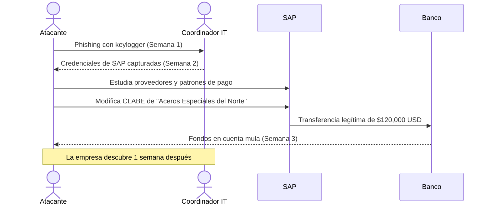
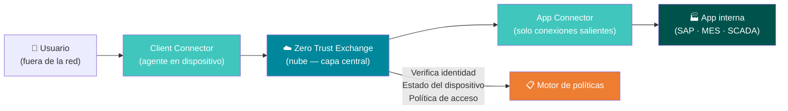
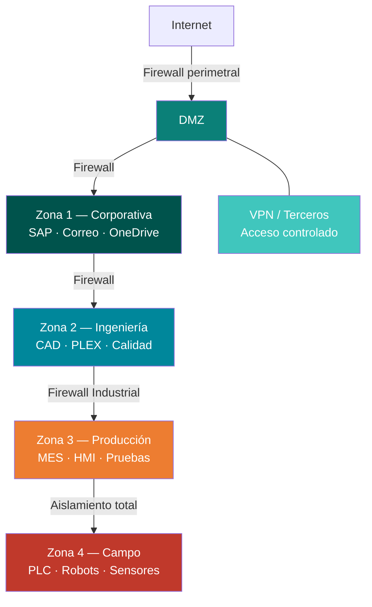

<div class="absolute right-0 top-0 bottom-0 w-[42%] bg-[#00879B]/92 flex flex-col justify-center pl-8 pr-6 z-10 overflow-hidden">
  <h1 class="text-white text-2xl font-light leading-tight mb-3 pb-3" style="border-bottom: 2px solid #40C6BD; border-color: #40C6BD !important;">
    Gestión de Identidad<br/>y Arquitectura<br/>Zero Trust
  </h1>
  <h2 class="text-[#B1DFDC] text-base font-light mb-5">
    Día 2 — Credenciales, MFA<br/>y Privilegio Mínimo
  </h2>
  <p class="text-white/90 text-sm font-semibold">INDEX Ciudad Juárez</p>
  <p class="text-white/60 text-xs mt-1">25 de marzo de 2026 · Sesión 2 de 4</p>
</div>

---
layout: quote
---

# "Si el atacante tiene tus credenciales, tiene tu empresa."

**Principio fundamental de seguridad de identidad**

<!--
Hoy asumimos que el phishing del Día 1 funcionó. El atacante ya está adentro. ¿Qué tan lejos puede llegar?
-->

---
layout: center
---

# ¿Cómo está tu planta hoy? — Identidad

<div class="grid grid-cols-3 gap-4 mt-4 text-center text-sm">

<div class="border-2 border-red-300 rounded-xl p-4 bg-red-50">
  <div class="text-3xl mb-2">🔴</div>
  <div class="text-red-700 font-bold text-base mb-2">Riesgo Alto</div>
  <div class="text-red-600 text-xs space-y-1">
    <div>Sin MFA en ningún sistema</div>
    <div>Cuentas de exempleados activas</div>
    <div>Sin política de privilegio mínimo</div>
    <div>Acceso de terceros sin control</div>
  </div>
</div>

<div class="border-2 border-amber-300 rounded-xl p-4 bg-amber-50">
  <div class="text-3xl mb-2">🟡</div>
  <div class="text-amber-700 font-bold text-base mb-2">Riesgo Medio</div>
  <div class="text-amber-600 text-xs space-y-1">
    <div>MFA solo en VPN</div>
    <div>Revisión de cuentas semestral</div>
    <div>Algunos accesos documentados</div>
    <div>Offboarding informal</div>
  </div>
</div>

<div class="border-2 border-green-300 rounded-xl p-4 bg-green-50">
  <div class="text-3xl mb-2">🟢</div>
  <div class="text-green-700 font-bold text-base mb-2">Riesgo Bajo</div>
  <div class="text-green-600 text-xs space-y-1">
    <div>MFA en todos los sistemas críticos</div>
    <div>Offboarding en ≤48h (IT+RRHH)</div>
    <div>Auditoría trimestral de permisos</div>
    <div>PAM para cuentas admin</div>
  </div>
</div>

</div>

<div class="tip-teal text-sm mt-4 text-center">
  <carbon-information class="text-teal-700" /> Al final del día sabrás cómo mover tu planta hacia la columna verde.
</div>

<!--
Show of hands: ¿quién está en rojo? ¿amarillo? ¿verde? Diagnóstico honesto, sin juicios.
-->

---
layout: two-cols
---

# Recap — Día 1

**Amenazas con IA e Ingeniería Social**

- Phishing con IA: personalizado, perfecto, masivo
- BEC: el ataque más costoso en manufactura
- Deepfakes de voz ya son una amenaza real
- Cadena de suministro = eslabón más débil

**Métricas aprendidas:**
- Phishing Click Rate → meta **< 5%**
- Security Awareness Coverage → meta **≥ 90%**

::right::

# Agenda — Día 2

| Bloque | Tema |
|--------|------|
| 🎯 Bloque 1 | Control de accesos |
| 🔬 Lab 3 | OverTheWire Bandit |
| 🎭 Lab 4 | Ataque de credenciales |
| 🏗️ Ejercicio | Diseño Zero Trust |

---
layout: section
---

# Bloque 1
## Control de accesos en maquiladoras de Juárez

---
layout: fact
background: /images/workers-maquiladora.jpg
---

# 40–80%

## Rotación anual de operadores en maquiladoras de Juárez

*Cuentas de exempleados activas semanas después de su salida*

---

# El problema de identidad en planta


<v-clicks>

## Alta rotación de personal
- Cuentas de exempleados activas **semanas** después de su salida
- Cambios de turno/posición que no actualizan permisos en sistemas
- Operadores que comparten credenciales entre turnos

## Acceso de terceros sin control
- Técnicos de Fanuc, KUKA, ABB con credenciales permanentes
- Auditores de GM, Ford, BMW conectados a red interna
- MSP (IT gestionado externo) con acceso privilegiado total
- Consultores con cuentas activas meses después del proyecto

</v-clicks>

<!--
Preguntar: ¿Alguien sabe exactamente cuántas cuentas activas tiene su empresa hoy?
-->

---

# Sistemas críticos y su riesgo

| Sistema | Usuarios | Si se compromete... |
|---------|----------|---------------------|
| **SAP / Oracle ERP** | Finanzas, Compras, RRHH | Fraude financiero, fuga de nóminas |
| **MES** | Ingeniería, Producción | Manipulación de órdenes de fabricación |
| **Office 365** | Todos | Phishing masivo, BEC desde cuenta real |
| **VPN corporativa** | IT, Ingeniería, Gerencia | Acceso total a red interna |
| **SCADA / HMI** | Mantenimiento | Sabotaje de línea de producción |
| **Nómina (Kronos)** | RRHH, Finanzas | Fraude de nómina, robo de CLABE |

<v-click>

> **La pregunta clave para cada sistema:** ¿Quién tiene acceso? ¿Necesita ese nivel? ¿Cuándo se revisó por última vez?

</v-click>

---

# Caso real — Robo de acceso a SAP en planta de asientos



<!--
600 empleados. Sin MFA en SAP. Sin alertas de cambio de datos bancarios. Sin segregación de funciones.
-->

---
layout: two-cols
---

# MFA — Tipos y aplicación en planta

| Tipo | Ejemplo | Recomendado para |
|------|---------|-----------------|
| App autenticadora | Microsoft Authenticator | Oficinas, Ingeniería |
| Token físico | YubiKey | Administradores de IT |
| SMS | Código por texto | Último recurso |
| Biométrico | Huella, rostro | Áreas restringidas |
| Tarjeta inteligente | Smart card + PIN | SCADA crítico |

::right::

## El desafío en producción

**Problema:** El operador de línea no tiene celular disponible durante el turno.

**Soluciones:**

<v-clicks>

- Kioscos con **tarjeta + PIN** para terminales de producción
- MFA solo para sistemas administrativos y privilegiados
- Tokens físicos para **supervisores de turno**
- Biométrico en acceso físico a cuartos de servidores

</v-clicks>

---

# Cuentas privilegiadas — El objetivo principal

**Un atacante con cuenta de admin tiene acceso total a todo**

<v-clicks>

**Inventario típico en maquiladora:**
- Administradores de dominio (Active Directory)
- Administradores de SAP (BASIS)
- Root en servidores Linux/Windows
- Cuentas de servicio de aplicaciones
- Admins de firewall, switches y VPN
- Acceso remoto de proveedores de equipos OEM

</v-clicks>

<v-click>

## Regla del privilegio mínimo

> Un **ingeniero de calidad** no necesita acceso al módulo financiero de SAP.
> Un **técnico de mantenimiento** no necesita acceso a la red de oficinas.
> Un **usuario de nómina** no necesita derechos de admin local en su PC.

</v-click>

---
layout: two-cols
---

# Estándares — Día 2

## NIST Cybersecurity Framework

| Función | Aplicación hoy |
|---------|---------------|
| **Identify** | Inventariar usuarios, sistemas, accesos |
| **Protect** | MFA, privilegio mínimo, revisión periódica |

## ISO 27001

| Control | Implementación |
|---------|---------------|
| **A.5** — Control de accesos | Política formal por cargo |
| **A.6** — Gestión de identidades | Proceso onboarding/offboarding |
| **A.9** — Acceso a sistemas | Auditoría trimestral de permisos |

::right::

# Métricas de Identidad

## MFA Coverage Rate

| Tipo de cuenta | Meta |
|---------------|------|
| Admins de IT | **100%** |
| Usuarios ERP | **95%** |
| Acceso VPN | **100%** |
| Correo | **80%** |

## Privileged Account Ratio

```
PAR = (Cuentas admin / Total) × 100
Meta: < 5%
```

*500 usuarios → máximo 25 cuentas admin*

---

# ✅ Cierre — Bloque 1

<div class="grid grid-cols-3 gap-5 mt-4">

<div class="tip-teal p-4 rounded-xl text-center">
  <div class="text-2xl mb-2">🔑</div>
  <div class="text-[#00534C] font-bold mb-1">Credenciales = acceso total</div>
  <div class="text-xs text-gray-600">Con usuario y contraseña válidos, el atacante puede hacer todo lo que hace el empleado. MFA es la diferencia.</div>
</div>

<div class="tip-warn p-4 rounded-xl text-center">
  <div class="text-2xl mb-2">👤</div>
  <div class="text-[#7C3912] font-bold mb-1">Rotación + sin offboarding = riesgo</div>
  <div class="text-xs text-gray-600">40–80% de rotación anual. Cada cuenta de exempleado activa es una puerta abierta.</div>
</div>

<div class="tip-danger p-4 rounded-xl text-center">
  <div class="text-2xl mb-2">👑</div>
  <div class="text-red-700 font-bold mb-1">Privilegio mínimo es no negociable</div>
  <div class="text-xs text-gray-600">El ingeniero de calidad no necesita acceso financiero en SAP. Limitar acceso limita el daño.</div>
</div>

</div>

<v-click>

<div class="mt-4 p-3 bg-[#00534C] text-white rounded-xl text-sm text-center">
  <strong>Pregunta para el lab:</strong> Si un atacante obtiene credenciales de un usuario normal en tu planta, ¿a qué sistemas tendría acceso?
</div>

</v-click>

---
layout: center
---

<Poll question="Antes del lab: ¿Tu empresa tiene un proceso formal de offboarding que incluye deshabilitar cuentas en sistemas?" :answers="['Sí, IT las deshabilita el mismo día de la baja', 'Sí, pero tarda varios días', 'No hay proceso formal', 'No lo sé con certeza']" />

<!--
El promedio en manufactura sin proceso formal: cuentas activas 30-60 días después de la baja.
-->

---
layout: section
background: /images/server-network.jpg
---

# Lab 3
## Linux Security con OverTheWire Bandit

<div class="grid grid-cols-4 gap-2 mt-4 text-xs text-center">
  <div class="bg-white/20 rounded-lg p-2"><div class="text-xl">⏱️</div><div class="font-bold">45 min</div></div>
  <div class="bg-white/20 rounded-lg p-2"><div class="text-xl">💻</div><div class="font-bold">Operador</div><div class="opacity-80 text-xs">ejecuta comandos</div></div>
  <div class="bg-white/20 rounded-lg p-2"><div class="text-xl">🔍</div><div class="font-bold">Analista</div><div class="opacity-80 text-xs">interpreta permisos</div></div>
  <div class="bg-white/20 rounded-lg p-2"><div class="text-xl">📋</div><div class="font-bold">Documentador</div><div class="opacity-80 text-xs">registra hallazgos</div></div>
</div>

<div class="mt-4 text-sm">
🔗 <strong>bandit.labs.overthewire.org</strong> · Puerto 2220
</div>

---

# Lab 3 — Conexión y niveles objetivo

**Conectarse al servidor:**

```bash
ssh bandit0@bandit.labs.overthewire.org -p 2220
# Contraseña inicial: bandit0
```

| Nivel | Habilidad practicada | Relevancia industrial |
|-------|---------------------|----------------------|
| 0–1 | Leer archivos, navegación | Logs de sistemas industriales |
| 2–3 | Archivos ocultos | Configs de red OT |
| 4–5 | Tipos de archivo | Archivos de configuración PLC |
| 6–7 | Permisos de usuario/grupo | Servidores Linux en planta |
| 8–9 | Búsqueda en texto | Análisis de logs de eventos |

---

# Lab 3 — Permisos en servidor de planta

**Archivo de configuración de SCADA en Linux:**

```bash {all|1-3|5-6}
# ❌ Configuración insegura (frecuente en plantas de Juárez)
ls -la /etc/scada/config.ini
-rw-rw-rw- 1 root root 2048 Mar 15 config.ini
# Todos los usuarios pueden leer Y escribir → RIESGO CRÍTICO

# ✅ Corrección correcta
chmod 640 /etc/scada/config.ini
# Solo root lee+escribe, grupo solo lee, nadie más accede
```

**Detectar cuentas con privilegios excesivos:**

```bash
# Ver quién tiene sudo (acceso de administrador)
grep -v "^#" /etc/sudoers

# Intentos fallidos de login (posible ataque en curso)
grep "Failed password" /var/log/auth.log | tail -20
```

---
layout: section
background: /images/log-analysis.jpg
---

# Lab 4
## Simulación de ataque de credenciales

<div class="grid grid-cols-4 gap-2 mt-4 text-xs text-center">
  <div class="bg-white/20 rounded-lg p-2"><div class="text-xl">⏱️</div><div class="font-bold">45 min</div></div>
  <div class="bg-white/20 rounded-lg p-2"><div class="text-xl">🔍</div><div class="font-bold">Analista</div><div class="opacity-80 text-xs">lee los logs</div></div>
  <div class="bg-white/20 rounded-lg p-2"><div class="text-xl">🛡️</div><div class="font-bold">Defensor</div><div class="opacity-80 text-xs">propone controles</div></div>
  <div class="bg-white/20 rounded-lg p-2"><div class="text-xl">🎤</div><div class="font-bold">Presentador</div><div class="opacity-80 text-xs">expone al grupo</div></div>
</div>

---

# Lab 4 — Ataque en Active Directory: 2:30 AM

**Planta de dispositivos médicos en Juárez — Logs de esa noche:**

```text {all|1-3|4|5-6|7-8}
02:31:15  FAILED LOGIN - User: jlopez  - IP: 192.168.1.105  [intento 1/3]
02:31:16  FAILED LOGIN - User: jlopez  - IP: 192.168.1.105  [intento 2/3]
02:31:17  FAILED LOGIN - User: jlopez  - IP: 192.168.1.105  [intento 3/3]
02:32:10  SUCCESS LOGIN - User: rherrera - IP: 192.168.1.105  ← COMPROMETIDO
02:32:12  ACCESS       - User: rherrera - \\fileserver\Finanzas
02:32:45  FILE DOWNLOAD - nomina_2026_Q1.xlsx  (2.1 MB)
02:33:01  FILE DOWNLOAD - lista_empleados_completa.xlsx  (890 KB)
02:33:22  FILE DOWNLOAD - expedientes_RRHH_marzo.zip  (45 MB)
```

<v-click>

**Preguntas del equipo:** ¿Qué tipo de ataque es este? ¿Por qué 2:30 AM? ¿La IP es interna o externa? ¿Qué datos fueron robados?

</v-click>

---

# Lab 4 — Respuesta inmediata

**Acciones en orden de prioridad:**

<v-clicks>

- [ ] **Deshabilitar** cuenta `rherrera` inmediatamente en Active Directory
- [ ] **Bloquear** IP `192.168.1.105` en el firewall
- [ ] **Notificar** al responsable de ciberseguridad — no resolver solo
- [ ] **No modificar** los logs (preservar evidencia forense)
- [ ] **Notificar a RRHH** — posible fuga de datos personales de empleados
- [ ] **Revisar** qué más accedió la misma IP antes de esa hora

</v-clicks>

<v-click>

| Control preventivo | Implementación | Costo |
|-------------------|---------------|-------|
| Account Lockout (5 intentos) | GPO en Active Directory | **Gratis** |
| MFA en correo y VPN | Microsoft Authenticator | **Incluido en M365** |
| Alerta de login nocturno | Azure AD o SIEM | Variable |
| Restricción horaria | GPO — solo 6AM–10PM | **Gratis** |

</v-click>

---
layout: center
---

# ⏸️ Pausa de 5 minutos — Reflexión activa

<div class="grid grid-cols-2 gap-6 mt-4 max-w-2xl mx-auto">

<div class="tip-teal p-5 rounded-xl text-center">
  <div class="text-3xl mb-3">✍️</div>
  <div class="text-[#00534C] font-bold mb-2">Escribe una cosa</div>
  <div class="text-sm text-gray-600">¿Qué cuenta o acceso de tu planta cambiarías <strong>mañana</strong> con lo que viste hoy?</div>
</div>

<div class="tip-warn p-5 rounded-xl text-center">
  <div class="text-3xl mb-3">💬</div>
  <div class="text-[#7C3912] font-bold mb-2">Comparte con un compañero</div>
  <div class="text-sm text-gray-600">60 segundos cada uno. ¿Cuál es el mayor riesgo de identidad en tu área específica?</div>
</div>

</div>

<div class="mt-5 text-center text-sm text-gray-500">
  <carbon-time class="text-gray-500" /> Regresamos en <strong>5 minutos</strong> para el ejercicio de diseño Zero Trust
</div>

<!--
Pausa genuina. No avanzar slides. Los participantes necesitan conectar lo aprendido con su realidad específica.
-->

---
layout: section
background: /images/tecmilenio-teamwork.jpeg
---

# Ejercicio
## Diseño de arquitectura Zero Trust

---
layout: quote
---

# "Nunca confíes, siempre verifica."

## Zero Trust — El principio

*No importa si estás dentro de la red. Cada acceso se verifica.*

---

# Zero Trust — Modelo tradicional vs nuevo

<v-clicks>

## Modelo tradicional en maquiladoras
```
Estás dentro de la red de planta
        ↓
Se confía en ti automáticamente
        ↓
Un atacante que entra por phishing tiene acceso a TODO
```

## Modelo Zero Trust
```
Cada acceso se verifica, sin importar el origen
Los sistemas NO confían entre sí automáticamente
El acceso se otorga solo para la tarea específica
La sesión se monitorea continuamente
```

</v-clicks>

---

# Zero Trust — Los 4 principios clave

<div class="grid grid-cols-2 gap-4 mt-4">

<div class="tip-teal p-4 rounded-xl">
  <div class="text-[#00534C] font-bold mb-1">🎯 Reducir la superficie de ataque</div>
  <div class="text-xs text-gray-600">Si la aplicación no es visible en internet, no puede ser atacada. Zero Trust oculta recursos internos completamente.</div>
</div>

<div class="tip-warn p-4 rounded-xl">
  <div class="text-[#7C3912] font-bold mb-1">🛡️ Proteger contra amenazas avanzadas</div>
  <div class="text-xs text-gray-600">Inspección del tráfico en la nube con políticas centralizadas. Detecta malware y comportamientos anómalos en tiempo real.</div>
</div>

<div class="tip-danger p-4 rounded-xl">
  <div class="text-red-700 font-bold mb-1">🚫 Evitar movimientos laterales</div>
  <div class="text-xs text-gray-600">El usuario accede <strong>solo a la aplicación</strong> que necesita, nunca a la red completa. Un dispositivo comprometido no puede propagarse.</div>
</div>

<div class="border border-[#B1DFDC] rounded-xl p-4 bg-[#f0fafa]">
  <div class="text-[#00534C] font-bold mb-1">🔒 Proteger los datos</div>
  <div class="text-xs text-gray-600">Control estricto de exfiltración. Las políticas de datos se aplican centralmente: qué se puede descargar, desde dónde y con qué dispositivo.</div>
</div>

</div>

---

# El problema con las VPNs

<v-clicks>

## VPN amplía tu superficie de ataque

```
VPN tradicional:
  IP pública expuesta en internet
        ↓
  Visible y escaneable por atacantes
        ↓
  Tunnel cifrado → pero el usuario entra a la RED INTERNA
        ↓
  Confianza implícita: acceso a más recursos de los necesarios
```

## Si un dispositivo comprometido entra por VPN:

</v-clicks>

<v-click>

<div class="grid grid-cols-3 gap-3 mt-2 text-xs text-center">
  <div class="bg-red-100 border border-red-300 rounded-lg p-3">
    <div class="font-bold text-red-700 mb-1">1. Entrada</div>
    <div class="text-red-600">Laptop infectada se conecta por VPN con credenciales válidas</div>
  </div>
  <div class="bg-red-100 border border-red-300 rounded-lg p-3">
    <div class="font-bold text-red-700 mb-1">2. Movimiento lateral</div>
    <div class="text-red-600">El malware escanea la red interna y salta de sistema en sistema</div>
  </div>
  <div class="bg-red-100 border border-red-300 rounded-lg p-3">
    <div class="font-bold text-red-700 mb-1">3. Escalada</div>
    <div class="text-red-600">Encuentra cuenta admin, compromete SAP, ERP, controladores OT</div>
  </div>
</div>

</v-click>

<!--
El túnel cifrado protege el tráfico, pero no protege lo que pasa adentro de la red una vez que el usuario ya entró.
-->

---

# Arquitectura Zero Trust — Cómo funciona

<Transform :scale="0.9">



</Transform>

<div class="grid grid-cols-3 gap-3 mt-3 text-xs">

<div class="tip-teal text-center">
  <div class="font-bold text-[#00534C]">Client Connector</div>
  <div class="text-gray-600">Agente en el dispositivo del usuario. Conecta al usuario con la nube de forma segura.</div>
</div>

<div class="tip-teal text-center">
  <div class="font-bold text-[#00534C]">App Connector</div>
  <div class="text-gray-600">Solo abre conexiones <strong>salientes</strong>. La app nunca queda expuesta en internet. No hay IP pública.</div>
</div>

<div class="tip-teal text-center">
  <div class="font-bold text-[#00534C]">Zero Trust Exchange</div>
  <div class="text-gray-600">Capa central en la nube. Valida identidad, dispositivo, contexto y aplica políticas de datos.</div>
</div>

</div>

---

# Zero Trust — Beneficios en producción

<v-clicks>

## Sin superficie de ataque visible

> Las aplicaciones internas no tienen IP pública. Si no se ven, no se pueden atacar.
> Los escáneres de internet no detectan SAP, MES ni SCADA.

## Segmentación usuario–aplicación (no red completa)

> El técnico de KUKA accede **solo** al HMI de su robot.
> El auditor de GM ve **solo** los reportes de calidad que le corresponden.
> Un dispositivo comprometido **no puede moverse** a otros sistemas.

## Inspección centralizada y protección de datos

> Todo el tráfico pasa por la nube → se detectan amenazas avanzadas en tiempo real.
> Se aplican políticas de DLP: bloquear descargas masivas, exfiltración por USB o email.

</v-clicks>

<v-click>

<div class="mt-3 p-3 bg-[#00534C] text-white rounded-xl text-sm text-center">
  <strong>Regla Zero Trust:</strong> Nunca confíes por defecto · Mantén usuarios fuera de la red · Valida identidad + estado del dispositivo · Acceso mínimo por tarea
</div>

</v-click>

---

# Glosario Zero Trust — Términos clave

<div class="grid grid-cols-3 gap-3 mt-4 text-xs">

<div class="border border-[#40C6BD] rounded-xl p-3 bg-[#f0fafa]">
  <div class="text-[#00534C] font-bold text-sm mb-1">🪪 Identidad (MFA/IdP)</div>
  <div class="text-gray-600">Verificación de quién eres antes de dar acceso. Combina contraseña + segundo factor (app, token, huella).</div>
</div>

<div class="border border-[#40C6BD] rounded-xl p-3 bg-[#f0fafa]">
  <div class="text-[#00534C] font-bold text-sm mb-1">💻 Agente de Endpoint</div>
  <div class="text-gray-600">Software instalado en la laptop o PC del usuario que reporta su estado de salud antes de permitir el acceso.</div>
</div>

<div class="border border-[#40C6BD] rounded-xl p-3 bg-[#f0fafa]">
  <div class="text-[#00534C] font-bold text-sm mb-1">🔑 ZTNA — Acceso a Apps</div>
  <div class="text-gray-600">Zero Trust Network Access. Conecta al usuario solo con la aplicación específica que necesita, nunca con la red completa.</div>
</div>

<div class="border border-[#40C6BD] rounded-xl p-3 bg-[#f0fafa]">
  <div class="text-[#00534C] font-bold text-sm mb-1">🧱 Microsegmentación</div>
  <div class="text-gray-600">Divide la red en zonas muy pequeñas. Si un sistema es comprometido, el atacante no puede saltar a los demás.</div>
</div>

<div class="border border-[#40C6BD] rounded-xl p-3 bg-[#f0fafa]">
  <div class="text-[#00534C] font-bold text-sm mb-1">🔬 Inspección de Tráfico</div>
  <div class="text-gray-600">Analiza el contenido del tráfico (incluyendo HTTPS cifrado) para detectar malware, exfiltración y ataques en tiempo real.</div>
</div>

<div class="border border-[#40C6BD] rounded-xl p-3 bg-[#f0fafa]">
  <div class="text-[#00534C] font-bold text-sm mb-1">🩺 Salud del Dispositivo</div>
  <div class="text-gray-600">Verifica que el dispositivo cumpla políticas: parches al día, antivirus activo, cifrado habilitado. Si no cumple, acceso denegado.</div>
</div>

</div>

---
layout: center
---

# Glosario — Identidad (MFA / IdP)

<div class="max-w-2xl mx-auto mt-4 space-y-4">

<div class="border-l-4 border-[#00879B] pl-4">
  <div class="text-xs text-gray-400 font-mono uppercase mb-1">Definición técnica</div>
  <div class="text-base text-gray-700">Proceso de verificar que un usuario es quien dice ser, usando <strong>múltiples factores</strong> (algo que sabes + algo que tienes + algo que eres) a través de un <strong>Proveedor de Identidad (IdP)</strong> centralizado.</div>
</div>

<div class="border-l-4 border-[#ED7D31] pl-4">
  <div class="text-xs text-gray-400 font-mono uppercase mb-1">En tu planta</div>
  <div class="text-base text-gray-700">El coordinador de IT ingresa su contraseña <strong>y</strong> aprueba una notificación en su celular para conectarse a SAP. Sin el celular, no entra aunque tenga la contraseña correcta.</div>
</div>

<div class="tip-teal text-sm text-center mt-2">
  <strong>Productos:</strong> Microsoft Authenticator · Cisco Duo · FortiAuthenticator · YubiKey
</div>

</div>

---
layout: center
---

# Glosario — Agente de Endpoint

<div class="max-w-2xl mx-auto mt-4 space-y-4">

<div class="border-l-4 border-[#00879B] pl-4">
  <div class="text-xs text-gray-400 font-mono uppercase mb-1">Definición técnica</div>
  <div class="text-base text-gray-700">Software ligero instalado en cada dispositivo que <strong>reporta su estado de seguridad</strong> al sistema Zero Trust: versión de SO, parches, antivirus, cifrado de disco y comportamiento en tiempo real.</div>
</div>

<div class="border-l-4 border-[#ED7D31] pl-4">
  <div class="text-xs text-gray-400 font-mono uppercase mb-1">En tu planta</div>
  <div class="text-base text-gray-700">La laptop del auditor de GM llega sin los parches de marzo. El agente detecta el incumplimiento y <strong>bloquea el acceso a la red de ingeniería</strong> hasta que se actualice.</div>
</div>

<div class="tip-teal text-sm text-center mt-2">
  <strong>Productos:</strong> GlobalProtect · FortiClient · Cisco AnyConnect · Harmony Endpoint · Zscaler Client Connector
</div>

</div>

---
layout: center
---

# Glosario — ZTNA (Acceso a Apps)

<div class="max-w-2xl mx-auto mt-4 space-y-4">

<div class="border-l-4 border-[#00879B] pl-4">
  <div class="text-xs text-gray-400 font-mono uppercase mb-1">Definición técnica</div>
  <div class="text-base text-gray-700"><strong>Zero Trust Network Access.</strong> El usuario se conecta únicamente a la aplicación autorizada, no a la red. La aplicación nunca queda expuesta en internet — solo recibe tráfico validado por el broker en la nube.</div>
</div>

<div class="border-l-4 border-[#ED7D31] pl-4">
  <div class="text-xs text-gray-400 font-mono uppercase mb-1">En tu planta</div>
  <div class="text-base text-gray-700">El técnico de KUKA accede <strong>solo al HMI de su robot</strong>, no a toda la red OT. Aunque su laptop esté infectada, no puede ver el SCADA ni el MES de las otras líneas.</div>
</div>

<div class="tip-teal text-sm text-center mt-2">
  <strong>Productos:</strong> Prisma Access · FortiGate ZTNA · Cisco Secure Access · Zscaler Private Access
</div>

</div>

---
layout: center
---

# Glosario — Microsegmentación

<div class="max-w-2xl mx-auto mt-4 space-y-4">

<div class="border-l-4 border-[#00879B] pl-4">
  <div class="text-xs text-gray-400 font-mono uppercase mb-1">Definición técnica</div>
  <div class="text-base text-gray-700">División de la red en <strong>segmentos muy pequeños con políticas propias</strong>. Cada carga de trabajo, aplicación o usuario tiene su propio perímetro. Un compromiso en un segmento no se propaga automáticamente a otros.</div>
</div>

<div class="border-l-4 border-[#ED7D31] pl-4">
  <div class="text-xs text-gray-400 font-mono uppercase mb-1">En tu planta</div>
  <div class="text-base text-gray-700">Un ransomware entra por la PC de RRHH. Con microsegmentación, <strong>no puede saltar a SAP, al MES ni a los controladores de línea</strong>. El daño queda contenido en el segmento de oficinas.</div>
</div>

<div class="tip-teal text-sm text-center mt-2">
  <strong>Productos:</strong> App-ID / Prisma Cloud · FortiTrust · TrustSec (SGT) · Maestro Security Groups
</div>

</div>

---
layout: center
---

# Glosario — Inspección de Tráfico

<div class="max-w-2xl mx-auto mt-4 space-y-4">

<div class="border-l-4 border-[#00879B] pl-4">
  <div class="text-xs text-gray-400 font-mono uppercase mb-1">Definición técnica</div>
  <div class="text-base text-gray-700">Análisis del contenido del tráfico de red, incluyendo <strong>HTTPS descifrado</strong>, para detectar malware, comandos C2, exfiltración de datos y tráfico anómalo. Opera en Capa 7 del modelo OSI (nivel de aplicación).</div>
</div>

<div class="border-l-4 border-[#ED7D31] pl-4">
  <div class="text-xs text-gray-400 font-mono uppercase mb-1">En tu planta</div>
  <div class="text-base text-gray-700">Un empleado sube la lista de proveedores a su Dropbox personal usando HTTPS cifrado. El sistema <strong>descifra, analiza y bloquea</strong> la transferencia antes de que salga de la empresa.</div>
</div>

<div class="tip-teal text-sm text-center mt-2">
  <strong>Productos:</strong> Content-ID · Firepower (Snort) · ThreatCloud AI · Zscaler SSL Inspection
</div>

</div>

---
layout: center
---

# Glosario — Salud del Dispositivo

<div class="max-w-2xl mx-auto mt-4 space-y-4">

<div class="border-l-4 border-[#00879B] pl-4">
  <div class="text-xs text-gray-400 font-mono uppercase mb-1">Definición técnica</div>
  <div class="text-base text-gray-700"><strong>Device Posture / Posture Assessment.</strong> Evaluación continua del estado de seguridad del dispositivo antes y durante cada sesión: parches aplicados, antivirus activo, disco cifrado, sin jailbreak, certificado corporativo presente.</div>
</div>

<div class="border-l-4 border-[#ED7D31] pl-4">
  <div class="text-xs text-gray-400 font-mono uppercase mb-1">En tu planta</div>
  <div class="text-base text-gray-700">Un ingeniero intenta conectarse desde su laptop personal. El sistema detecta que <strong>no tiene el certificado corporativo ni el antivirus requerido</strong> y redirige a una página de remediación en lugar de dar acceso.</div>
</div>

<div class="tip-teal text-sm text-center mt-2">
  <strong>Productos:</strong> HIP (GlobalProtect) · EMS Compliance · ISE Posture · Device Posture Check
</div>

</div>

---

# Zero Trust — Comparativa Multi-Fabricante

<Transform :scale="0.78">

| Concepto Zero Trust | Palo Alto | Fortinet | Cisco | Check Point | Zscaler |
|---------------------|-----------|----------|-------|-------------|---------|
| **Identidad (MFA/IdP)** | Cloud Identity Engine | FortiAuthenticator | Cisco Duo | Harmony Connect | ZPA (Private Access) |
| **Agente de Endpoint** | GlobalProtect / Cortex | FortiClient | AnyConnect (Secure Client) | Harmony Endpoint | Zscaler Client Connector |
| **Acceso a Apps (ZTNA)** | Prisma Access | FortiGate ZTNA | Secure Access | Quantum SD-WAN | Zscaler Private Access |
| **Microsegmentación** | App-ID / Prisma Cloud | FortiTrust / VDOMs | TrustSec (SGT) | Maestro / Security Groups | Segmentación por Software |
| **Inspección de Tráfico** | Content-ID | SSL Inspection | Firepower (Snort) | ThreatCloud AI | SSL Inspection (Cloud) |
| **Salud del Dispositivo** | HIP (Host Information) | EMS Compliance | ISE Posture | Compliance Check | Device Posture Check |

</Transform>

<div class="tip-teal text-xs mt-2 text-center">
  <carbon-information class="text-teal-700" /> Todos implementan los mismos principios Zero Trust — cambia el nombre del producto, no el concepto.
</div>

---

# Los 4 Niveles de Seguridad — Quién y Con Qué

<div class="grid grid-cols-2 gap-5 mt-4">

<div class="border-2 border-[#00879B] rounded-xl p-4">
  <div class="flex items-center gap-2 mb-3">
    <div class="text-2xl">👤</div>
    <div>
      <div class="text-[#00534C] font-bold text-base">Nivel 1 — Usuario</div>
      <div class="text-xs text-gray-500 font-mono">Autenticación Adaptativa</div>
    </div>
  </div>
  <div class="text-sm text-gray-700 bg-[#f0fafa] rounded-lg p-3">
    <strong>¿Quién eres?</strong><br/>
    Si intentas entrar a las <strong>3:00 AM desde un país donde no tenemos oficinas</strong>, el sistema te bloquea aunque tu contraseña sea correcta.
  </div>
  <div class="mt-2 text-xs text-gray-500">Aplica en: Duo, FortiAuthenticator, Cloud Identity Engine</div>
</div>

<div class="border-2 border-[#ED7D31] rounded-xl p-4">
  <div class="flex items-center gap-2 mb-3">
    <div class="text-2xl">💻</div>
    <div>
      <div class="text-[#7C3912] font-bold text-base">Nivel 2 — Dispositivo</div>
      <div class="text-xs text-gray-500 font-mono">Posture Assessment</div>
    </div>
  </div>
  <div class="text-sm text-gray-700 bg-amber-50 rounded-lg p-3">
    <strong>¿Con qué entras?</strong><br/>
    <em>"No te dejo ver los datos de los clientes si tu <strong>Windows no tiene el último parche de seguridad</strong> instalado."</em>
  </div>
  <div class="mt-2 text-xs text-gray-500">Aplica en: HIP, EMS Compliance, ISE Posture, Device Posture Check</div>
</div>

</div>

---

# Los 4 Niveles de Seguridad — A Qué y Qué te Llevas

<div class="grid grid-cols-2 gap-5 mt-4">

<div class="border-2 border-[#00534C] rounded-xl p-4">
  <div class="flex items-center gap-2 mb-3">
    <div class="text-2xl">📱</div>
    <div>
      <div class="text-[#00534C] font-bold text-base">Nivel 3 — Aplicación</div>
      <div class="text-xs text-gray-500 font-mono">L7 App Awareness (Capa 7)</div>
    </div>
  </div>
  <div class="text-sm text-gray-700 bg-[#f0fafa] rounded-lg p-3">
    <strong>¿A qué entras?</strong><br/>
    <em>"Puedes entrar al Facebook de la empresa para publicar, pero tienes <strong>prohibido usar el chat o subir archivos</strong>."</em>
  </div>
  <div class="mt-2 text-xs text-gray-500">Aplica en: App-ID / Prisma Cloud, Firepower (Snort), Content-ID, ThreatCloud AI</div>
</div>

<div class="border-2 border-red-400 rounded-xl p-4">
  <div class="flex items-center gap-2 mb-3">
    <div class="text-2xl">🔐</div>
    <div>
      <div class="text-red-700 font-bold text-base">Nivel 4 — Datos</div>
      <div class="text-xs text-gray-500 font-mono">DLP — Data Loss Prevention</div>
    </div>
  </div>
  <div class="text-sm text-gray-700 bg-red-50 rounded-lg p-3">
    <strong>¿Qué te llevas?</strong><br/>
    <em>"Si intentas copiar la lista de precios a un <strong>USB o subirla a tu Dropbox personal</strong>, el sistema cifra el archivo o bloquea la subida."</em>
  </div>
  <div class="mt-2 text-xs text-gray-500">Aplica en: Zscaler SSL Inspection, FortiTrust, ThreatCloud AI, Prisma Cloud</div>
</div>

</div>

<div class="mt-3 p-2 bg-[#00534C] text-white rounded-lg text-xs text-center">
  Zero Trust no es un producto — es aplicar estos 4 niveles juntos, con cualquier fabricante.
</div>

---

# Zonas de seguridad en maquiladora

<Transform :scale="0.88">



</Transform>

---

# Controles de acceso por zona

| Zona | MFA | Dispositivo | Horario |
|------|-----|-------------|---------|
| Corporativa | Sí | Corp + personal | 24/7 |
| Ingeniería | Sí | Solo corporativo | Lun–Sáb 6AM–10PM |
| Producción | Tarjeta+PIN | Solo terminales planta | N/A |
| Acceso remoto | Sí + Ticket | Solo corporativo | Con ticket abierto |

**Acceso de técnico de KUKA / Fanuc / ABB:**

<v-clicks>

1. Solicitud por escrito con justificación y duración
2. Cuenta temporal con acceso **limitado** al sistema específico
3. Supervisión activa durante el servicio
4. Revocación **automática** al cerrar el ticket
5. Log completo de actividades del tercero

</v-clicks>

---

# 🖼️ Gallery Walk — Comparte tu diseño Zero Trust

<div class="grid grid-cols-2 gap-6 mt-3">

<div>

**Instrucciones (15 minutos):**

<v-clicks>

1. 📌 **Presenta** el diagrama de zonas de tu equipo
2. 👀 **Revisa** los diseños de los demás equipos (2 min c/u)
3. ✅ **Post-it verde** — algo que agregarías al diseño
4. ❓ **Post-it amarillo** — brecha de seguridad que detectas
5. 🎤 **Defiende** tu propuesta en 2 minutos

</v-clicks>

</div>

<div class="flex flex-col gap-3">

<div class="tip-teal text-sm">
  <carbon-checkmark class="text-teal-700" /> <strong>Meta:</strong> Cada planta sale con un borrador real de segmentación de red
</div>

<div class="tip-warn text-sm">
  <carbon-warning-alt-filled class="text-orange-600" /> <strong>Criterio de éxito:</strong> ¿El diseño habría detenido el ataque a SAP del caso real?
</div>

<div class="border border-[#B1DFDC] rounded-lg p-3 text-xs bg-[#f0fafa]">
  <div class="font-bold text-[#00534C] mb-1">Rúbrica</div>
  <div class="text-gray-600">✅ Define al menos 3 zonas separadas<br/>✅ MFA en accesos administrativos<br/>✅ Protocolo de acceso de terceros<br/>✅ Proceso de offboarding incluido</div>
</div>

</div>

</div>

---
layout: two-cols-header
---

# Conclusiones — Día 2

::left::

## Lo que aprendiste hoy

<v-clicks>

- Las credenciales robadas son la llave maestra a todo
- MFA es obligatorio en VPN, ERP y cuentas admin
- El principio de privilegio mínimo limita el daño de un ataque
- Zero Trust asume que el atacante ya está dentro
- La rotación de personal requiere offboarding formal con IT

</v-clicks>

::right::

## Implementable esta semana

<v-clicks>

1. 🔐 Activar MFA en VPN y correo (incluido en M365)
2. 👥 Auditar cuentas de exempleados en Active Directory
3. 🔒 Habilitar Account Lockout tras 5 intentos fallidos (GPO)
4. 📋 Crear proceso formal de offboarding: RRHH notifica a IT el mismo día de baja

</v-clicks>

---

# 🃏 Tu tarjeta de bolsillo — Día 2

<div class="border-2 border-[#40C6BD] rounded-xl p-4 mt-2 bg-[#f0fafa]">
<div class="text-center text-xs text-[#00534C] font-bold mb-3 pb-2 border-b border-[#B1DFDC]">✂️ Recorta y pega en tu escritorio</div>

<div class="grid grid-cols-3 gap-3 text-xs">

<div>
<div class="font-bold text-[#00534C] mb-1">🔑 Si alguien pide acceso urgente:</div>
<ol class="text-gray-700 space-y-0.5 list-decimal pl-4">
  <li>Verifica identidad por canal diferente</li>
  <li>Crea cuenta temporal con acceso mínimo</li>
  <li>Registra quién, para qué y hasta cuándo</li>
  <li>Revoca acceso al cerrar el ticket</li>
  <li>Revisa log de actividad posterior</li>
</ol>
</div>

<div>
<div class="font-bold text-[#00534C] mb-1">🚪 Offboarding — Checklist:</div>
<ul class="text-gray-700 space-y-0.5 list-disc pl-4">
  <li>Deshabilitar en Active Directory ≤48h</li>
  <li>Revocar acceso VPN y MFA</li>
  <li>Deshabilitar cuenta SAP/ERP</li>
  <li>Recuperar equipo corporativo</li>
  <li>Cambiar contraseñas de sistemas compartidos</li>
</ul>
</div>

<div>
<div class="font-bold text-[#00534C] mb-1">🚨 Login sospechoso — actúa:</div>
<ol class="text-gray-700 space-y-0.5 list-decimal pl-4">
  <li>Deshabilitar cuenta inmediatamente en AD</li>
  <li>Bloquear IP en firewall</li>
  <li>NO borrar logs (evidencia forense)</li>
  <li>Notificar a IT Security y RRHH</li>
  <li>Revisar qué más accedió esa IP</li>
</ol>
</div>

</div>

<div class="mt-3 pt-2 border-t border-[#B1DFDC] text-center text-xs text-gray-500">
  Ciberseguridad Manufacturera · INDEX Ciudad Juárez · Día 2 · <strong>IT Security:</strong> ________________
</div>

</div>

<!--
Imprimir una por participante o pedir que tomen foto.
-->

---
layout: end
---

# Hasta mañana

## Reflexión para llevar

> Si un exempleado de tu planta intentara acceder hoy con sus credenciales anteriores... ¿podría entrar a algún sistema?

---

**Mañana — Día 3: Datos, Nube y Redes Industriales**

Seguridad en Microsoft 365 · Redes OT/ICS · OWASP Juice Shop · Diseño de red IT/OT segmentada

*8:00 AM · INDEX Ciudad Juárez*
