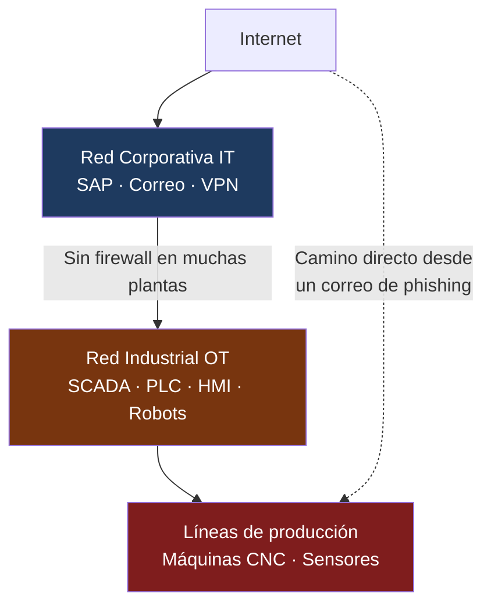

# Ciberseguridad para la Industria Manufacturera

## Día 3 — Seguridad de Datos, Nube y Redes Industriales

**INDEX Ciudad Juárez · 26 de marzo de 2026**

<div class="pt-6 text-gray-400">
  4 horas · Sesión 3 de 4
</div>

---
layout: quote
---

# "No puedes proteger lo que no conoces."

**Principio fundamental de gestión de activos — CIS Control 1**

<!--
Hoy exploramos qué datos tienen las plantas, dónde están, y cómo protegerlos tanto en la nube como en las redes industriales.
-->

---
layout: two-cols
---

# Recap — Días 1 y 2

**Día 1: Amenazas con IA**
- Phishing personalizado con IA
- BEC y fraude corporativo
- Deepfakes de voz y video

**Día 2: Identidad y Zero Trust**
- MFA en sistemas críticos
- Privilegio mínimo
- Arquitectura Zero Trust

**Métricas aprendidas:**
- MFA Coverage → admins **100%**
- Privileged Account Ratio → **< 5%**

::right::

# Agenda — Día 3

| Bloque | Tema |
|--------|------|
| 🎯 Bloque 1 | Convergencia IT/OT en Juárez |
| 🔬 Lab 5 | OWASP Juice Shop |
| 🎭 Lab 6 | Auditoría de nube |
| 🏗️ Ejercicio | Arquitectura IT/OT segmentada |

---
layout: section
---

# Bloque 1
## La convergencia IT/OT en maquiladoras

---

# El problema de la convergencia en Juárez


**Las plantas ya no tienen redes aisladas**



<v-click>

**El resultado:** Un correo de phishing abierto en oficinas puede llegar a los PLC de producción por una red plana sin segmentación.

</v-click>

---

# Datos industriales que proteger en Juárez

| Tipo de dato | Ejemplo en planta | Valor para atacante |
|-------------|-------------------|---------------------|
| **Diseños de producto** | Planos de arneses para Ford F-150 | Venta a competencia asiática |
| **Procesos de manufactura** | Parámetros de soldadura para iPhone | Replicación del proceso |
| **BOM (Lista de materiales)** | Componentes para dispositivos médicos | Espionaje industrial |
| **Datos de clientes** | Forecast de producción de Delphi | Información estratégica |
| **Especificaciones de calidad** | Tolerancias de piezas aeroespaciales | Falsificación de componentes |

---

# Exfiltración de datos — Cómo sale la información

<div class="float-right ml-4 mb-2">
  
</div>

<v-clicks>

- 🔌 **USB no autorizado** — Operador saca diseños en memoria personal
- 📧 **Email personal** — Empleado se reenvía archivos a Gmail o Hotmail
- ☁️ **Nube personal** — Subir archivos a Google Drive o Dropbox personales
- 🖨️ **Impresión no controlada** — Documentos técnicos impresos y sacados físicamente
- 📱 **Fotografías** — Fotografiar pantallas con diseños o datos de sistema

</v-clicks>

<v-click>

> **Caso en Juárez:** Ingeniero de proceso que se va a trabajar con la competencia y antes de salir reenvía 3 años de documentación técnica a su correo personal. Sin DLP, nadie lo detecta.

</v-click>

---

# Errores de configuración en Microsoft 365

**La mayoría de las plantas en Juárez usan M365. Los errores más comunes:**

<v-clicks>

**Error 1 — Enlace público por accidente**
```
Ingeniero comparte carpeta de diseños con "Cualquiera con el enlace"
→ El enlace queda accesible en internet sin autenticación
→ Especificaciones técnicas del cliente indexadas en Google
```

**Error 2 — Permisos heredados excesivos**
```
Carpeta de RRHH hereda permisos de "Corporativo" (400 empleados)
→ Todos los empleados pueden ver nóminas y expedientes
```

**Error 3 — Sincronización en dispositivos personales**
```
Gerente sincroniza OneDrive corporativo en laptop personal sin MDM
→ Al robar o perder la laptop, los datos quedan completamente expuestos
```

</v-clicks>

---

# Protocolos industriales — Vulnerabilidades OT

| Protocolo | Usado en Juárez | Vulnerabilidad principal |
|-----------|----------------|--------------------------|
| **PROFINET** | Líneas Bosch, Continental | Sin autenticación nativa |
| **EtherNet/IP** | Robots Allen-Bradley (Rockwell) | Comandos no cifrados |
| **Modbus TCP** | Sensores y actuadores industriales | Sin autenticación, texto claro |
| **OPC-UA** | Historizadores de datos | Configuración incorrecta frecuente |
| **BACnet** | HVAC de plantas limpias | Accesible desde red corporativa |

<v-click>

> Estos protocolos fueron diseñados para redes **aisladas**. Al conectarlos a la red corporativa o internet, se vuelven vulnerables porque no requieren autenticación y no cifran la comunicación.

</v-click>

---
layout: two-cols
---

# ISA/IEC 62443 — Zonas de seguridad

**Zonas del estándar para OT:**

| Zona | Descripción |
|------|-------------|
| **Zona 0** | Campo — Sensores, actuadores, PLC |
| **Zona 1** | Control — SCADA, DCS, HMI |
| **Zona 2** | Operaciones — MES, Historian |
| **Zona 3** | Corporativa — ERP, correo, IT |

**Principio:** Cada zona separada por **firewall industrial (Conduit)**

::right::

# NIST SP 800-82 — ICS Security

**Recomendaciones clave:**

<v-clicks>

- Inventario completo de dispositivos OT
- Segmentación entre IT y OT
- Parches con proceso específico para OT (sin interrumpir producción)
- Monitoreo **pasivo** de red OT (no intrusivo)
- Respaldo de configuraciones de PLC/SCADA

</v-clicks>

---
layout: two-cols-header
---

# Métricas — Día 3

::left::

## Patch Compliance Rate

```
Compliance = (Sistemas parcheados en ≤72h /
              Total de sistemas críticos) × 100
```

**Meta:** 100% en 72 horas

**Realidad OT en maquiladoras:**
- PLC con 5–10 años sin actualizar
- Windows XP/7 en estaciones HMI
- Parches coordinados con paradas de mantenimiento programadas

::right::

## Asset Inventory Coverage

```
Inventario = (Activos identificados /
              Total estimado) × 100
```

**Meta:** **100%**
*Herramienta gratuita: Nmap para IT*

## Data Exposure Index

```
DEI = Archivos/carpetas críticas con
      acceso público o excesivo
```

**Meta:** **0** archivos críticos públicos

---
layout: section
---

# Lab 5
## Seguridad Web con OWASP Juice Shop

---

# Lab 5 — Instalación local

**Sin necesidad de internet — Correr localmente:**

```bash
# Con Docker (recomendado)
docker pull bkimminich/juice-shop
docker run -d -p 3000:3000 bkimminich/juice-shop
# Acceder en: http://localhost:3000
```

**¿Por qué es relevante para maquiladoras?**

<v-clicks>

- Portal de proveedores para envío de facturas
- Sistema de calidad online (PPAP, 8D)
- Portal de empleados para nómina y vacaciones
- Acceso remoto vía web a sistemas MES
- Dashboard de producción para clientes (Ford, GM)

</v-clicks>

---

# Lab 5 — SQL Injection

**Objetivo:** Acceder como administrador sin conocer la contraseña

```sql {all|1-2|4-6}
-- Campo de email del login:
' OR 1=1--

-- La consulta SQL queda así:
SELECT * FROM users WHERE email='' OR 1=1--' AND password='...'
-- 1=1 siempre es verdadero → Acceso concedido
```

<v-click>

**Impacto en portal de proveedores de maquiladora:**
- Ver información de todos los proveedores registrados
- Acceder a facturas de otros proveedores
- Modificar datos de pago o información bancaria

</v-click>

<v-click>

**Prevención:** Siempre usar consultas parametrizadas (prepared statements). Nunca construir SQL con concatenación de strings.

</v-click>

---

# Lab 5 — XSS y Manipulación de Sesión

<v-clicks>

## XSS — Cross-Site Scripting

```javascript
// En campo de comentario o búsqueda:
<script>alert('XSS en portal de proveedores!')</script>
```

**Impacto:** Robar cookies de sesión de empleados de compras, redirigir a página falsa de login.

## Manipulación de sesión

1. Hacer login con cuenta propia
2. Inspeccionar el token JWT (F12 → Application → Cookies)
3. Decodificar en `jwt.io` — ¿qué información contiene?
4. Si usa IDs predecibles: cambiar `user_id=1043` → `user_id=1044`

**Impacto:** Ver información confidencial de otro proveedor sin autorización.

</v-clicks>

---
layout: section
background: /images/cloud-security.jpg
---

# Lab 6
## Auditoría de configuración de nube Microsoft 365

---

# Lab 6 — Escenario: Precision Medical Juárez

**Planta de instrumental médico para Honeywell / GE**
**Situación:** Documentación técnica confidencial descargada desde IPs de China.

**Lista de verificación de auditoría:**

<v-clicks>

**SharePoint / OneDrive:**
- [ ] ¿Hay carpetas compartidas con "Cualquiera con el enlace"?
- [ ] ¿Dispositivos personales pueden sincronizar OneDrive corporativo?
- [ ] ¿Existe política de retención y eliminación de datos?

**Exchange / Correo:**
- [ ] ¿Está habilitado el reenvío automático a cuentas externas?
- [ ] ¿Configurados DMARC, DKIM y SPF en el dominio?

**Azure Active Directory:**
- [ ] ¿Hay cuentas de invitado sin uso reciente (> 90 días)?
- [ ] ¿Está habilitado Conditional Access?

</v-clicks>

---

# Lab 6 — Hallazgos típicos en maquiladoras

| Hallazgo | Riesgo | Corrección |
|----------|--------|-----------|
| 47 carpetas con enlace público | 🔴 Alto | Auditar y revocar enlaces |
| Reenvío automático del CFO a Gmail | 🚨 Crítico | Deshabilitar + alerta |
| 23 cuentas de invitado sin uso (180 días) | 🟡 Medio | Eliminar cuentas inactivas |
| 3 apps con permiso "Leer todos los archivos" | 🔴 Alto | Revocar permisos excesivos |
| Sin Conditional Access configurado | 🔴 Alto | Bloquear países de riesgo |

<v-click>

> **Herramientas gratuitas para auditar M365:**
> - Microsoft Secure Score (portal.microsoft.com)
> - Microsoft Defender for Cloud Apps (alertas básicas)
> - Azure AD Sign-in logs (detectar accesos desde ubicaciones inusuales)

</v-click>

---
layout: section
---

# Ejercicio Práctico
## Diseño de red segmentada IT/OT — Planta aeroespacial en Juárez

---

# El incidente que queremos evitar

**Componentes aeroespaciales para Honeywell · Parque Industrial Aeropuerto, Juárez**

<div class="border border-red-500 bg-red-950 rounded p-4 text-sm my-3">

**Incidente real (empresa ficticia):**
Ransomware ingresó por correo electrónico en una laptop de ingeniería.
Por la **red plana** (sin segmentación), llegó al servidor del MES y cifró órdenes de producción.

- Producción detenida: **18 horas**
- Pérdida estimada: **$340,000 USD**
- Vector de entrada: red plana sin segmentación IT/OT

</div>

**La pregunta del ejercicio:** ¿Cómo habría cambiado el resultado con una red segmentada?

---

# Ejercicio — Diseñar la arquitectura segura

**Los equipos diseñarán la segmentación para esta planta:**

<v-clicks>

**Zonas a definir:**
- Zona de usuarios (PCs de oficina, laptops)
- Zona de servidores corporativos (ERP, archivos)
- Zona de ingeniería (CAD, sistemas de calidad)
- Zona OT (MES, Historian, SCADA)
- Zona de campo (PLC, HMI, robots)
- Zona DMZ (portal de proveedores, acceso remoto)

**Preguntas a responder:**
1. ¿Qué sistemas van en cada zona?
2. ¿Qué tráfico está permitido entre zonas?
3. ¿Hasta dónde hubiera llegado el ransomware con esta red?
4. ¿Qué sistemas quedan protegidos?

</v-clicks>

---

# Tráfico de referencia entre zonas

| Origen | Destino | ¿Permitido? | Control |
|--------|---------|------------|---------|
| Usuario → Internet | Internet | ✅ Sí | Proxy + filtro web |
| Usuario → SAP | Servidores | ✅ Sí | HTTPS + MFA |
| Usuario → PLC | OT | ❌ No | Firewall industrial bloquea |
| Ingeniero → MES | OT | ✅ Restringido | MFA + solo horario laboral |
| MES → PLC | OT | ✅ Sí | Protocolo específico (EtherNet/IP) |
| Internet → Portal | DMZ | ✅ Sí | WAF + HTTPS |
| Proveedor → Red interna | — | ❌ No | DMZ aislada |

---
layout: two-cols-header
---

# Conclusiones — Día 3

::left::

## Lo que aprendiste hoy

<v-clicks>

- La convergencia IT/OT sin segmentación es el mayor riesgo en plantas de Juárez
- M365 mal configurado es una fuente masiva de fuga de datos
- Los protocolos industriales (Modbus, PROFINET) no fueron diseñados para estar en redes abiertas
- Un inventario 100% de activos es el primer paso para protegerlos

</v-clicks>

::right::

## Implementable esta semana

<v-clicks>

1. 🔍 Auditar Microsoft Secure Score en portal.microsoft.com
2. 🔗 Revocar todos los enlaces de SharePoint con acceso público
3. 📋 Iniciar inventario de dispositivos OT (Nmap en red industrial)
4. 🔥 Evaluar si existe firewall entre red de oficinas y red de producción

</v-clicks>

---
layout: end
---

# Hasta mañana

## Reflexión para llevar

> ¿Existe en tu planta una ruta de red directa entre las laptops de ingeniería y los PLC de producción? Si esa laptop se infecta mañana, ¿hasta dónde puede llegar el atacante?

---

**Mañana — Día 4: Respuesta a Incidentes y Ransomware**

Fases de respuesta · MTTD, MTTR, RTO · Blue Team Labs · Proyecto final del curso

*8:00 AM · INDEX Ciudad Juárez*
