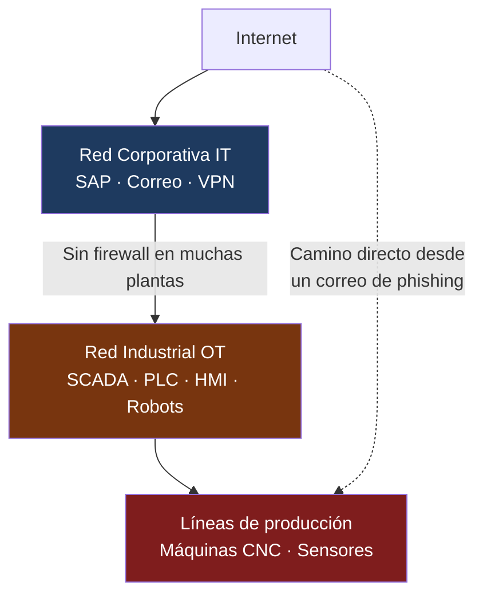

<div class="absolute right-0 top-0 bottom-0 w-[42%] bg-[#00879B]/92 flex flex-col justify-center pl-8 pr-6 z-10 overflow-hidden">
  <h1 class="text-white text-2xl font-light leading-tight mb-3 pb-3" style="border-bottom: 2px solid #40C6BD; border-color: #40C6BD !important;">
    Ciberseguridad<br/>para la Industria<br/>Manufacturera
  </h1>
  <h2 class="text-[#B1DFDC] text-base font-light mb-5">
    Día 3 — Datos, Nube y Redes Industriales
  </h2>
  <p class="text-white/90 text-sm font-semibold">INDEX Ciudad Juárez</p>
  <p class="text-white/60 text-xs mt-1">26 de marzo de 2026 · Sesión 3 de 4</p>
</div>

---
layout: quote
---

# "No puedes proteger lo que no conoces."

**Principio fundamental de gestión de activos — CIS Control 1**

<!--
Hoy exploramos qué datos tienen las plantas, dónde están, y cómo protegerlos tanto en la nube como en las redes industriales.
-->

---
layout: center
---

# Antes de empezar...

<Poll question="En tu planta, ¿saben qué archivos están compartidos con acceso público en la nube?" :answers="['Sí, tenemos auditoría actualizada', 'Creemos que sí, pero no estamos seguros', 'No lo sabemos', 'No usamos nube corporativa']" />

<!--
Dejar 60 segundos para que voten. Esta pregunta revela el nivel real de visibilidad sobre datos en la nube.
-->

---
layout: two-cols
---

# Recap — Días 1 y 2

**Día 1: Amenazas con IA**
- Phishing personalizado con IA
- BEC y fraude corporativo
- Deepfakes de voz y video

**Día 2: Identidad y Zero Trust**
- MFA en sistemas críticos
- Privilegio mínimo
- Arquitectura Zero Trust

**Métricas aprendidas:**
- MFA Coverage → admins **100%**
- Privileged Account Ratio → **< 5%**

::right::

# Agenda — Día 3

| Bloque | Tema |
|--------|------|
| 🎯 Bloque 1 | Convergencia IT/OT en Juárez |
| 🔬 Lab 5 | OWASP Juice Shop |
| 🎭 Lab 6 | Auditoría de nube |
| 🏗️ Ejercicio | Arquitectura IT/OT segmentada |

---
layout: center
---

# ¿Cómo está tu planta hoy?

<div class="grid grid-cols-3 gap-4 mt-4 text-center text-sm">

<div class="border-2 border-red-300 rounded-xl p-4 bg-red-50">
  <div class="text-3xl mb-2">🌡️</div>
  <div class="text-red-700 font-bold text-base mb-2">Riesgo Alto</div>
  <div class="text-red-600 text-xs space-y-1">
    <div>Datos en OneDrive sin auditar</div>
    <div>Sin firewall entre IT y OT</div>
    <div>PLCs accesibles desde red de oficinas</div>
    <div>Sin inventario de activos OT</div>
  </div>
</div>

<div class="border-2 border-amber-300 rounded-xl p-4 bg-amber-50">
  <div class="text-3xl mb-2">⚠️</div>
  <div class="text-amber-700 font-bold text-base mb-2">Riesgo Medio</div>
  <div class="text-amber-600 text-xs space-y-1">
    <div>M365 con revisión ocasional</div>
    <div>Segmentación parcial IT/OT</div>
    <div>Inventario incompleto de activos</div>
    <div>Sin DLP activo</div>
  </div>
</div>

<div class="border-2 border-green-300 rounded-xl p-4 bg-green-50">
  <div class="text-3xl mb-2">✅</div>
  <div class="text-green-700 font-bold text-base mb-2">Riesgo Bajo</div>
  <div class="text-green-600 text-xs space-y-1">
    <div>Microsoft Secure Score &gt; 70%</div>
    <div>Firewall industrial IT/OT activo</div>
    <div>Inventario 100% de activos OT</div>
    <div>DLP en M365 configurado</div>
  </div>
</div>

</div>

<div class="tip-teal text-sm mt-4 text-center">
  <carbon-information class="text-teal-700" /> Al final del día, este termómetro debería verse diferente. Guarda mentalmente en qué columna está tu planta <strong>hoy</strong>.
</div>

<!--
Pedir que levanten la mano: ¿quién está en rojo? ¿amarillo? ¿verde?
-->

---
layout: section
---

# Bloque 1
## La convergencia IT/OT en maquiladoras

---

# El problema de la convergencia en Juárez


**Las plantas ya no tienen redes aisladas**



<v-click>

**El resultado:** Un correo de phishing abierto en oficinas puede llegar a los PLC de producción por una red plana sin segmentación.

</v-click>

---

# Datos industriales que proteger en Juárez

| Tipo de dato | Ejemplo en planta | Valor para atacante |
|-------------|-------------------|---------------------|
| **Diseños de producto** | Planos de arneses para Ford F-150 | Venta a competencia asiática |
| **Procesos de manufactura** | Parámetros de soldadura para iPhone | Replicación del proceso |
| **BOM (Lista de materiales)** | Componentes para dispositivos médicos | Espionaje industrial |
| **Datos de clientes** | Forecast de producción de Delphi | Información estratégica |
| **Especificaciones de calidad** | Tolerancias de piezas aeroespaciales | Falsificación de componentes |

---

# Exfiltración de datos — Cómo sale la información

<div class="float-right ml-4 mb-2">
  
</div>

<v-clicks>

- 🔌 **USB no autorizado** — Operador saca diseños en memoria personal
- 📧 **Email personal** — Empleado se reenvía archivos a Gmail o Hotmail
- ☁️ **Nube personal** — Subir archivos a Google Drive o Dropbox personales
- 🖨️ **Impresión no controlada** — Documentos técnicos impresos y sacados físicamente
- 📱 **Fotografías** — Fotografiar pantallas con diseños o datos de sistema

</v-clicks>

<v-click>

> **Caso en Juárez:** Ingeniero de proceso que se va a trabajar con la competencia y antes de salir reenvía 3 años de documentación técnica a su correo personal. Sin DLP, nadie lo detecta.

</v-click>

---

# Errores de configuración en Microsoft 365

**La mayoría de las plantas en Juárez usan M365. Los errores más comunes:**

<v-clicks>

**Error 1 — Enlace público por accidente**
```
Ingeniero comparte carpeta de diseños con "Cualquiera con el enlace"
→ El enlace queda accesible en internet sin autenticación
→ Especificaciones técnicas del cliente indexadas en Google
```

**Error 2 — Permisos heredados excesivos**
```
Carpeta de RRHH hereda permisos de "Corporativo" (400 empleados)
→ Todos los empleados pueden ver nóminas y expedientes
```

**Error 3 — Sincronización en dispositivos personales**
```
Gerente sincroniza OneDrive corporativo en laptop personal sin MDM
→ Al robar o perder la laptop, los datos quedan completamente expuestos
```

</v-clicks>

---

# Protocolos industriales — Vulnerabilidades OT

| Protocolo | Usado en Juárez | Vulnerabilidad principal |
|-----------|----------------|--------------------------|
| **PROFINET** | Líneas Bosch, Continental | Sin autenticación nativa |
| **EtherNet/IP** | Robots Allen-Bradley (Rockwell) | Comandos no cifrados |
| **Modbus TCP** | Sensores y actuadores industriales | Sin autenticación, texto claro |
| **OPC-UA** | Historizadores de datos | Configuración incorrecta frecuente |
| **BACnet** | HVAC de plantas limpias | Accesible desde red corporativa |

<v-click>

> Estos protocolos fueron diseñados para redes **aisladas**. Al conectarlos a la red corporativa o internet, se vuelven vulnerables porque no requieren autenticación y no cifran la comunicación.

</v-click>

---
layout: two-cols
---

# ISA/IEC 62443 — Zonas de seguridad

**Zonas del estándar para OT:**

| Zona | Descripción |
|------|-------------|
| **Zona 0** | Campo — Sensores, actuadores, PLC |
| **Zona 1** | Control — SCADA, DCS, HMI |
| **Zona 2** | Operaciones — MES, Historian |
| **Zona 3** | Corporativa — ERP, correo, IT |

**Principio:** Cada zona separada por **firewall industrial (Conduit)**

::right::

# NIST SP 800-82 — ICS Security

**Recomendaciones clave:**

<v-clicks>

- Inventario completo de dispositivos OT
- Segmentación entre IT y OT
- Parches con proceso específico para OT (sin interrumpir producción)
- Monitoreo **pasivo** de red OT (no intrusivo)
- Respaldo de configuraciones de PLC/SCADA

</v-clicks>

---
layout: two-cols-header
---

# Métricas — Día 3

::left::

## Patch Compliance Rate

```
Compliance = (Sistemas parcheados en ≤72h /
              Total de sistemas críticos) × 100
```

**Meta:** 100% en 72 horas

**Realidad OT en maquiladoras:**
- PLC con 5–10 años sin actualizar
- Windows XP/7 en estaciones HMI
- Parches coordinados con paradas de mantenimiento programadas

::right::

## Asset Inventory Coverage

```
Inventario = (Activos identificados /
              Total estimado) × 100
```

**Meta:** **100%**
*Herramienta gratuita: Nmap para IT*

## Data Exposure Index

```
DEI = Archivos/carpetas críticas con
      acceso público o excesivo
```

**Meta:** **0** archivos críticos públicos

---

# ✅ Cierre — Bloque 1

<div class="grid grid-cols-3 gap-5 mt-4">

<div class="tip-teal p-4 rounded-xl text-center">
  <div class="text-2xl mb-2">🔌</div>
  <div class="text-[#00534C] font-bold mb-1">Convergencia IT/OT</div>
  <div class="text-xs text-gray-600">La red plana entre oficinas y producción es el vector más crítico. Un phishing en una laptop puede llegar al PLC.</div>
</div>

<div class="tip-warn p-4 rounded-xl text-center">
  <div class="text-2xl mb-2">☁️</div>
  <div class="text-[#7C3912] font-bold mb-1">M365 mal configurado</div>
  <div class="text-xs text-gray-600">47 carpetas con enlace público es la norma. El reenvío automático a Gmail pasa desapercibido durante meses.</div>
</div>

<div class="tip-danger p-4 rounded-xl text-center">
  <div class="text-2xl mb-2">📡</div>
  <div class="text-red-700 font-bold mb-1">Protocolos OT sin defensa</div>
  <div class="text-xs text-gray-600">Modbus, PROFINET y EtherNet/IP fueron diseñados para redes aisladas. En redes abiertas son completamente vulnerables.</div>
</div>

</div>

<v-click>

<div class="mt-4 p-3 bg-[#00534C] text-white rounded-xl text-sm text-center">
  <strong>Pregunta para llevar al lab:</strong> ¿Cómo entran los atacantes a los sistemas web de tu planta y qué datos pueden robar?
</div>

</v-click>

---
layout: center
---

<Poll question="Antes del lab: ¿qué tan familiarizado estás con vulnerabilidades web como SQL Injection o XSS?" :answers="['Las conozco y sé cómo prevenirlas', 'He escuchado los términos pero no los domino', 'Son conceptos nuevos para mí', 'No manejo sistemas web en mi área']" />

<!--
Guardar estos resultados. Al final del lab verificar si cambió la percepción.
-->

---
layout: section
---

# Lab 5
## Seguridad Web con OWASP Juice Shop

---

# Lab 5 — Instalación local

**Sin necesidad de internet — Correr localmente:**

```bash
# Con Docker (recomendado)
docker pull bkimminich/juice-shop
docker run -d -p 3000:3000 bkimminich/juice-shop
# Acceder en: http://localhost:3000
```

**¿Por qué es relevante para maquiladoras?**

<v-clicks>

- Portal de proveedores para envío de facturas
- Sistema de calidad online (PPAP, 8D)
- Portal de empleados para nómina y vacaciones
- Acceso remoto vía web a sistemas MES
- Dashboard de producción para clientes (Ford, GM)

</v-clicks>

---

# Lab 5 — SQL Injection

**Objetivo:** Acceder como administrador sin conocer la contraseña

```sql {all|1-2|4-6}
-- Campo de email del login:
' OR 1=1--

-- La consulta SQL queda así:
SELECT * FROM users WHERE email='' OR 1=1--' AND password='...'
-- 1=1 siempre es verdadero → Acceso concedido
```

<v-click>

**Impacto en portal de proveedores de maquiladora:**
- Ver información de todos los proveedores registrados
- Acceder a facturas de otros proveedores
- Modificar datos de pago o información bancaria

</v-click>

<v-click>

**Prevención:** Siempre usar consultas parametrizadas (prepared statements). Nunca construir SQL con concatenación de strings.

</v-click>

---

# Lab 5 — XSS y Manipulación de Sesión

<v-clicks>

## XSS — Cross-Site Scripting

```javascript
// En campo de comentario o búsqueda:
<script>alert('XSS en portal de proveedores!')</script>
```

**Impacto:** Robar cookies de sesión de empleados de compras, redirigir a página falsa de login.

## Manipulación de sesión

1. Hacer login con cuenta propia
2. Inspeccionar el token JWT (F12 → Application → Cookies)
3. Decodificar en `jwt.io` — ¿qué información contiene?
4. Si usa IDs predecibles: cambiar `user_id=1043` → `user_id=1044`

**Impacto:** Ver información confidencial de otro proveedor sin autorización.

</v-clicks>

---
layout: section
background: /images/cloud-security.jpg
---

# Lab 6
## Auditoría de configuración de nube Microsoft 365

---

# Lab 6 — Escenario: Precision Medical Juárez

**Planta de instrumental médico para Honeywell / GE**
**Situación:** Documentación técnica confidencial descargada desde IPs de China.

**Lista de verificación de auditoría:**

<v-clicks>

**SharePoint / OneDrive:**
- [ ] ¿Hay carpetas compartidas con "Cualquiera con el enlace"?
- [ ] ¿Dispositivos personales pueden sincronizar OneDrive corporativo?
- [ ] ¿Existe política de retención y eliminación de datos?

**Exchange / Correo:**
- [ ] ¿Está habilitado el reenvío automático a cuentas externas?
- [ ] ¿Configurados DMARC, DKIM y SPF en el dominio?

**Azure Active Directory:**
- [ ] ¿Hay cuentas de invitado sin uso reciente (> 90 días)?
- [ ] ¿Está habilitado Conditional Access?

</v-clicks>

---

# Lab 6 — Hallazgos típicos en maquiladoras

| Hallazgo | Riesgo | Corrección |
|----------|--------|-----------|
| 47 carpetas con enlace público | 🔴 Alto | Auditar y revocar enlaces |
| Reenvío automático del CFO a Gmail | 🚨 Crítico | Deshabilitar + alerta |
| 23 cuentas de invitado sin uso (180 días) | 🟡 Medio | Eliminar cuentas inactivas |
| 3 apps con permiso "Leer todos los archivos" | 🔴 Alto | Revocar permisos excesivos |
| Sin Conditional Access configurado | 🔴 Alto | Bloquear países de riesgo |

<v-click>

> **Herramientas gratuitas para auditar M365:**
> - Microsoft Secure Score (portal.microsoft.com)
> - Microsoft Defender for Cloud Apps (alertas básicas)
> - Azure AD Sign-in logs (detectar accesos desde ubicaciones inusuales)

</v-click>

---
layout: center
---

# ⏸️ Pausa de 5 minutos — Reflexión activa

<div class="grid grid-cols-2 gap-6 mt-4 max-w-2xl mx-auto">

<div class="tip-teal p-5 rounded-xl text-center">
  <div class="text-3xl mb-3">✍️</div>
  <div class="text-[#00534C] font-bold mb-2">Escribe una cosa</div>
  <div class="text-sm text-gray-600">¿Qué cambiarías en tu planta <strong>esta semana</strong> con lo que viste en los labs de hoy?</div>
</div>

<div class="tip-warn p-5 rounded-xl text-center">
  <div class="text-3xl mb-3">💬</div>
  <div class="text-[#7C3912] font-bold mb-2">Comparte con un compañero</div>
  <div class="text-sm text-gray-600">60 segundos cada uno. Sin filtros — cualquier idea cuenta, por pequeña que sea.</div>
</div>

</div>

<div class="mt-5 text-center text-sm text-gray-500">
  <carbon-time class="text-gray-500" /> Regresamos en <strong>5 minutos</strong> para el ejercicio final
</div>

<!--
Usar este tiempo genuinamente. No avanzar el material.
-->

---
layout: section
background: /images/tecmilenio-teamwork.jpeg
---

# Ejercicio Práctico
## Diseño de red segmentada IT/OT — Planta aeroespacial en Juárez

---

# El incidente que queremos evitar

**Componentes aeroespaciales para Honeywell · Parque Industrial Aeropuerto, Juárez**

<div class="border border-red-500 bg-red-950 rounded p-4 text-sm my-3">

**Incidente real (empresa ficticia):**
Ransomware ingresó por correo electrónico en una laptop de ingeniería.
Por la **red plana** (sin segmentación), llegó al servidor del MES y cifró órdenes de producción.

- Producción detenida: **18 horas**
- Pérdida estimada: **$340,000 USD**
- Vector de entrada: red plana sin segmentación IT/OT

</div>

**La pregunta del ejercicio:** ¿Cómo habría cambiado el resultado con una red segmentada?

---

# Ejercicio — Diseñar la arquitectura segura

**Los equipos diseñarán la segmentación para esta planta:**

<v-clicks>

**Zonas a definir:**
- Zona de usuarios (PCs de oficina, laptops)
- Zona de servidores corporativos (ERP, archivos)
- Zona de ingeniería (CAD, sistemas de calidad)
- Zona OT (MES, Historian, SCADA)
- Zona de campo (PLC, HMI, robots)
- Zona DMZ (portal de proveedores, acceso remoto)

**Preguntas a responder:**
1. ¿Qué sistemas van en cada zona?
2. ¿Qué tráfico está permitido entre zonas?
3. ¿Hasta dónde hubiera llegado el ransomware con esta red?
4. ¿Qué sistemas quedan protegidos?

</v-clicks>

---

# Tráfico de referencia entre zonas

| Origen | Destino | ¿Permitido? | Control |
|--------|---------|------------|---------|
| Usuario → Internet | Internet | ✅ Sí | Proxy + filtro web |
| Usuario → SAP | Servidores | ✅ Sí | HTTPS + MFA |
| Usuario → PLC | OT | ❌ No | Firewall industrial bloquea |
| Ingeniero → MES | OT | ✅ Restringido | MFA + solo horario laboral |
| MES → PLC | OT | ✅ Sí | Protocolo específico (EtherNet/IP) |
| Internet → Portal | DMZ | ✅ Sí | WAF + HTTPS |
| Proveedor → Red interna | — | ❌ No | DMZ aislada |

---

# 🖼️ Gallery Walk — Comparte tu arquitectura

<div class="grid grid-cols-2 gap-6 mt-3">

<div>

**Instrucciones (15 minutos):**

<v-clicks>

1. 📌 **Pega** el diagrama de tu arquitectura en la pared (o compártelo en pantalla)
2. 👀 **Visita** las arquitecturas de los demás equipos — 2 min por equipo
3. ✅ **Agrega un post-it verde** con una zona de seguridad que agregarías
4. ❓ **Agrega un post-it amarillo** con una duda o mejora sugerida
5. 🎤 **Cada equipo** defiende su diseño en 2 minutos

</v-clicks>

</div>

<div class="flex flex-col gap-3">

<div class="tip-teal text-sm">
  <carbon-checkmark class="text-teal-700" /> <strong>Meta:</strong> Que cada planta salga con un borrador real de segmentación IT/OT
</div>

<div class="tip-warn text-sm">
  <carbon-warning-alt-filled class="text-orange-600" /> <strong>Criterio de éxito:</strong> El ransomware del incidente queda contenido en la zona de usuarios — ¿cómo lo garantiza tu diseño?
</div>

<div class="border border-[#B1DFDC] rounded-lg p-3 text-xs bg-[#f0fafa]">
  <div class="font-bold text-[#00534C] mb-1">Rúbrica rápida</div>
  <div class="text-gray-600">✅ Define al menos 4 zonas separadas<br/>✅ Especifica tráfico permitido entre zonas<br/>✅ Protege la red OT del acceso directo desde IT<br/>✅ Incluye DMZ para accesos externos</div>
</div>

</div>

</div>

---
layout: two-cols-header
---

# Conclusiones — Día 3

::left::

## Lo que aprendiste hoy

<v-clicks>

- La convergencia IT/OT sin segmentación es el mayor riesgo en plantas de Juárez
- M365 mal configurado es una fuente masiva de fuga de datos
- Los protocolos industriales (Modbus, PROFINET) no fueron diseñados para estar en redes abiertas
- Un inventario 100% de activos es el primer paso para protegerlos

</v-clicks>

::right::

## Implementable esta semana

<v-clicks>

1. 🔍 Auditar Microsoft Secure Score en portal.microsoft.com
2. 🔗 Revocar todos los enlaces de SharePoint con acceso público
3. 📋 Iniciar inventario de dispositivos OT (Nmap en red industrial)
4. 🔥 Evaluar si existe firewall entre red de oficinas y red de producción

</v-clicks>

---

# Recursos gratuitos para implementar esta semana

| Herramienta | Para qué | URL |
|-------------|----------|-----|
| <carbon-security class="text-green-600" /> **Microsoft Secure Score** | Auditoría gratuita de M365 | `portal.microsoft.com` |
| <carbon-search class="text-blue-600" /> **Nmap** | Inventario de activos IT y OT | `nmap.org` |
| <carbon-checkmark-filled class="text-teal-600" /> **OWASP Juice Shop** | Práctica de vulnerabilidades web | `owasp.org/www-project-juice-shop` |
| <carbon-catalog class="text-red-600" /> **MITRE ATT&CK for ICS** | Tácticas específicas para OT | `attack.mitre.org/matrices/ics` |
| <carbon-document class="text-teal-600" /> **NIST SP 800-82** | Guía de seguridad ICS/SCADA | `csrc.nist.gov` |
| <carbon-security class="text-blue-600" /> **CERT-MX** | Alertas de ciberseguridad para México | `gob.mx/certmx` |

<div class="mt-4 p-3 rounded text-sm tip-teal">
  <carbon-information class="text-teal-700" /> Empieza hoy mismo con Microsoft Secure Score — accede desde <strong>portal.microsoft.com</strong> sin instalar nada.
</div>

---

# 🃏 Tu tarjeta de bolsillo — Día 3

<div class="border-2 border-[#40C6BD] rounded-xl p-4 mt-2 bg-[#f0fafa]">
<div class="text-center text-xs text-[#00534C] font-bold mb-3 pb-2 border-b border-[#B1DFDC]">✂️ Recorta y pega en tu escritorio</div>

<div class="grid grid-cols-3 gap-3 text-xs">

<div>
<div class="font-bold text-[#00534C] mb-1">☁️ Auditoría urgente M365:</div>
<ol class="text-gray-700 space-y-0.5 list-decimal pl-4">
  <li>Revisar carpetas con enlace público</li>
  <li>Deshabilitar reenvío automático externo</li>
  <li>Eliminar cuentas invitado inactivas &gt; 90d</li>
  <li>Activar Conditional Access</li>
  <li>Verificar Microsoft Secure Score</li>
</ol>
</div>

<div>
<div class="font-bold text-[#00534C] mb-1">🔌 Protección IT/OT básica:</div>
<ol class="text-gray-700 space-y-0.5 list-decimal pl-4">
  <li>Inventariar dispositivos OT con Nmap</li>
  <li>¿Existe firewall entre red IT y OT?</li>
  <li>Bloquear acceso directo de usuarios a PLC</li>
  <li>Backup de configuraciones PLC/SCADA</li>
  <li>Coordinar parches OT con mantenimiento</li>
</ol>
</div>

<div>
<div class="font-bold text-[#00534C] mb-1">🚨 Si detectas fuga de datos:</div>
<ul class="text-gray-700 space-y-0.5 list-disc pl-4">
  <li>Revocar acceso del usuario inmediatamente</li>
  <li>NO borrar evidencia de logs</li>
  <li>Identificar qué archivos fueron accedidos</li>
  <li>Datos personales: notificar INAI en 72h</li>
  <li>Reportar a IT Security y RRHH</li>
</ul>
</div>

</div>

<div class="mt-3 pt-2 border-t border-[#B1DFDC] text-center text-xs text-gray-500">
  Ciberseguridad Manufacturera · INDEX Ciudad Juárez · Día 3 · <strong>IT Security:</strong> ________________
</div>

</div>

<!--
Imprimir una por participante antes de la sesión o pedir que tomen foto con el celular.
-->

---
layout: end
---

# Hasta mañana

## Reflexión para llevar

> ¿Existe en tu planta una ruta de red directa entre las laptops de ingeniería y los PLC de producción? Si esa laptop se infecta mañana, ¿hasta dónde puede llegar el atacante?

---

**Mañana — Día 4: Respuesta a Incidentes y Ransomware**

Fases de respuesta · MTTD, MTTR, RTO · Blue Team Labs · Proyecto final del curso

*8:00 AM · INDEX Ciudad Juárez*
