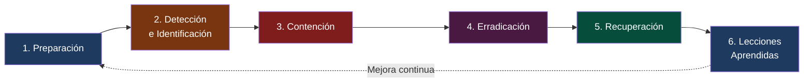
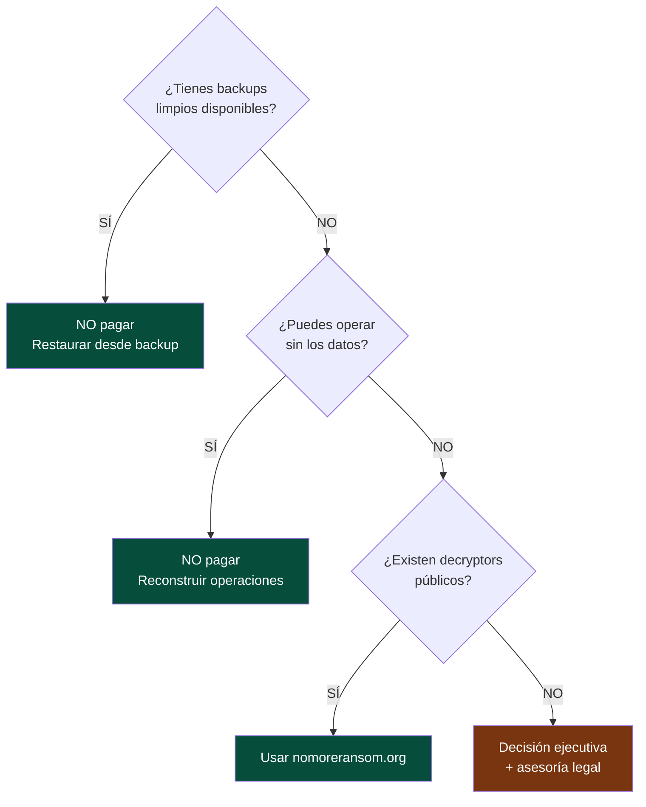

<div class="absolute right-0 top-0 bottom-0 w-[42%] bg-[#00879B]/92 flex flex-col justify-center pl-8 pr-6 z-10 overflow-hidden">
  <h1 class="text-white text-2xl font-light leading-tight mb-3 pb-3" style="border-bottom: 2px solid #40C6BD; border-color: #40C6BD !important;">
    Ciberseguridad<br/>para la Industria<br/>Manufacturera
  </h1>
  <h2 class="text-[#B1DFDC] text-base font-light mb-5">
    Día 4 — Respuesta a Incidentes y Ransomware
  </h2>
  <p class="text-white/90 text-sm font-semibold">INDEX Ciudad Juárez</p>
  <p class="text-white/60 text-xs mt-1">27 de marzo de 2026 · Sesión 4 de 4</p>
</div>

---
layout: quote
---

# "No es cuestión de si serás atacado, sino de cuándo."

**Robert Mueller — Ex Director del FBI**

<!--
El objetivo de hoy no es evitar el ataque. Es sobrevivir a él.
-->

---
layout: center
---

# Antes de empezar...

<Poll question="Si mañana tu planta sufre un ransomware, ¿tienes backups verificados listos para restaurar?" :answers="['Sí, backups offline probados recientemente', 'Tenemos backups pero no los hemos probado', 'Tenemos algo, pero no estamos seguros', 'No tenemos backups confiables']" />

<!--
Dejar 60 segundos para que voten. Esta respuesta define si la planta sobrevive a un ransomware.
-->

---
layout: two-cols
---

# Recap — Días 1, 2 y 3

**Día 1:** Phishing con IA · BEC · Deepfakes · Cadena de suministro

**Día 2:** MFA · Privilegio mínimo · Zero Trust · Credenciales

**Día 3:** M365 inseguro · Convergencia IT/OT · Protocolos industriales

**Métricas aprendidas:**
- Phishing Click Rate → **< 5%**
- MFA Coverage (admins) → **100%**
- Data Exposure Index → **0 archivos públicos**
- Asset Inventory → **100%**
- Patch Compliance → **< 72 horas**

::right::

# Agenda — Día 4

| Bloque | Tema |
|--------|------|
| 🎯 Bloque 1 | Respuesta a incidentes |
| 🔬 Lab 7 | Simulación de ransomware |
| 🎭 Lab 8 | Análisis de logs (Blue Team Labs) |
| 🏆 Proyecto | Simulación completa final |

---
layout: center
---

# ¿Cómo está tu planta hoy?

<div class="grid grid-cols-3 gap-4 mt-4 text-center text-sm">

<div class="border-2 border-red-300 rounded-xl p-4 bg-red-50">
  <div class="text-3xl mb-2">🌡️</div>
  <div class="text-red-700 font-bold text-base mb-2">Riesgo Alto</div>
  <div class="text-red-600 text-xs space-y-1">
    <div>Sin Plan de Respuesta a Incidentes</div>
    <div>Sin backups verificados</div>
    <div>Sin SIEM ni monitoreo de logs</div>
    <div>Sin roles definidos de respuesta</div>
  </div>
</div>

<div class="border-2 border-amber-300 rounded-xl p-4 bg-amber-50">
  <div class="text-3xl mb-2">⚠️</div>
  <div class="text-amber-700 font-bold text-base mb-2">Riesgo Medio</div>
  <div class="text-amber-600 text-xs space-y-1">
    <div>Plan documentado pero no practicado</div>
    <div>Backups sin prueba de restauración</div>
    <div>Logs guardados menos de 30 días</div>
    <div>Roles informales de respuesta</div>
  </div>
</div>

<div class="border-2 border-green-300 rounded-xl p-4 bg-green-50">
  <div class="text-3xl mb-2">✅</div>
  <div class="text-green-700 font-bold text-base mb-2">Riesgo Bajo</div>
  <div class="text-green-600 text-xs space-y-1">
    <div>IRP documentado y ejercitado</div>
    <div>Backups offline probados mensualmente</div>
    <div>SIEM con logs 90+ días</div>
    <div>Equipo de IR con contactos 24/7</div>
  </div>
</div>

</div>

<div class="tip-teal text-sm mt-4 text-center">
  <carbon-information class="text-teal-700" /> Al final del día, este termómetro debería verse diferente. Guarda mentalmente en qué columna está tu planta <strong>hoy</strong>.
</div>

<!--
Pedir que levanten la mano: ¿quién está en rojo? ¿amarillo? ¿verde?
-->

---
layout: section
---

# Bloque 1
## Respuesta a incidentes en manufactura

---
layout: fact
background: /images/factory-stopped.jpg
---

# $340,000 USD

## Costo de 18 horas de producción detenida por ransomware

*Planta aeroespacial en Juárez — vector de entrada: red IT/OT sin segmentación*

---

# El costo real de un incidente en maquiladora

| Tipo de pérdida | Ejemplo | Costo estimado |
|----------------|---------|----------------|
| **Producción detenida** | Línea de ensamble parada 24h | $50,000–$500,000 USD |
| **Penalizaciones del cliente** | Ford cobra por entrega tardía | Hasta 3× el valor del pedido |
| **Recuperación de sistemas** | IT externo, nuevos equipos | $20,000–$200,000 USD |
| **Investigación forense** | Empresa especializada en IR | $15,000–$80,000 USD |
| **Pérdida de contrato** | Riesgo de perder al cliente | Millones en ingresos anuales |

<v-click>

> **Caso documentado:** Planta electrónica en Juárez (2023) — Ransomware por phishing · 72 horas de producción parada · **$1.2 millones USD** de pérdida total.

</v-click>

---

# Las 6 fases de respuesta — NIST SP 800-61



---

# Fase 1 — Preparación (antes del ataque)

**Lo que debe existir ANTES de que ocurra el incidente:**

<v-clicks>

- [ ] Plan de Respuesta a Incidentes (IRP) documentado y aprobado
- [ ] Equipo de respuesta definido con roles y contactos 24/7
- [ ] Herramientas disponibles: EDR, SIEM, backups verificados
- [ ] Acuerdo con proveedor externo de IR (Incident Response)
- [ ] Ejercicios de simulación al menos una vez al año

</v-clicks>

<v-click>

| Rol | Responsabilidad | Quién en planta |
|-----|----------------|-----------------|
| Coordinador de IR | Dirige la respuesta | Gerente de IT / CISO |
| Técnico de sistemas | Aísla sistemas, preserva evidencia | Admin de red |
| Enlace con negocio | Coordina impacto con producción | Gerente de planta |
| Enlace legal/RRHH | Comunicación y compliance | Director RRHH |

</v-click>

---

# Fase 2 — Detección: IoCs en manufactura


**Indicadores de Compromiso más comunes en planta:**

<v-clicks>

**En la red:**
- Tráfico masivo a IPs externas en horarios nocturnos
- DNS queries a dominios recién registrados
- Conexiones a países sin operaciones de la empresa

**En endpoints:**
- Proceso desconocido consumiendo alta CPU/disco
- Archivos con extensión cambiada: `.locked`, `.encrypted`, `.RYUK`
- Nuevas cuentas de administrador creadas sin ticket

**Reportado por usuarios:**
- "Mi equipo está lento y hay archivos que no puedo abrir"
- Correo del CEO pidiendo algo inusual
- Acceso desde ubicación geográfica imposible (ej: Dallas y Mumbai simultáneo)

</v-clicks>

---

# Fase 3 — Contención inmediata

**Primeros 30 minutos — cada minuto cuenta:**

<v-clicks>

```
PRIORIDAD 1: Aislar sistemas afectados
  → Desconectar de la red (cable ethernet + WiFi)
  → NO apagar el equipo (se pierde evidencia en RAM)
  → Bloquear cuenta comprometida en Active Directory

PRIORIDAD 2: Identificar el alcance
  → ¿Cuántos equipos están afectados?
  → ¿Llegó a la red OT / producción?
  → ¿Se exfiltraron datos antes del cifrado?

PRIORIDAD 3: Proteger lo que no está infectado
  → Desconectar servidores de backup de la red
  → Aislar servidores de ERP si hay riesgo
  → Activar modo manual en producción si MES está comprometido
```

</v-clicks>

---

# Decisión crítica — ¿Se para producción?

| Escenario | Decisión recomendada |
|-----------|---------------------|
| Solo afecta PCs de oficina | Continuar producción, aislar red de oficinas |
| Afecta MES pero no PLC | Producción en **modo manual** documentado |
| Afecta PLC / SCADA | **Detener producción** — riesgo de accidentes |
| Afecta sistema de calidad | Detener o inspección 100% manual |

<v-click>

> Esta decisión la toma el **Gerente de Planta + IT juntos**, no IT solo. El impacto de parar producción puede ser enorme, pero continuar con sistemas comprometidos puede ser catastrófico.

</v-click>

---
layout: two-cols
---

# Estándares — Día 4

## NIST Cybersecurity Framework

| Función | Métrica |
|---------|---------|
| **Detect** | MTTD < 24 horas |
| **Respond** | MTTR < 4 horas |
| **Recover** | RTO < 8 horas |

## CIS Controls

| Control | Descripción |
|---------|-------------|
| **17** — Incident Response | Plan y equipo documentado |
| **8** — Log Management | SIEM con logs 90+ días |
| **13** — Network Monitoring | NDR o alertas de tráfico |

::right::

# Métricas de IR

## MTTD — Mean Time to Detect

```
MTTD = Hora de detección
     − Hora de inicio del ataque
```
**Meta:** < **24 horas**
Promedio sin SIEM: **3–6 meses**

## MTTR — Mean Time to Respond

```
MTTR = Hora de contención
     − Hora de detección
```
**Meta:** < **4 horas**

## RTO — Recovery Time Objective

**Meta por sistema:**
- Producción/MES: < 4h
- ERP (SAP): < 8h
- Correo: < 4h

---

# ✅ Cierre — Bloque 1

<div class="grid grid-cols-3 gap-5 mt-4">

<div class="tip-teal p-4 rounded-xl text-center">
  <div class="text-2xl mb-2">📋</div>
  <div class="text-[#00534C] font-bold mb-1">Preparación es todo</div>
  <div class="text-xs text-gray-600">El IRP, los roles y los backups deben existir ANTES del incidente. Improvisar en una crisis cuesta $340,000 USD.</div>
</div>

<div class="tip-warn p-4 rounded-xl text-center">
  <div class="text-2xl mb-2">⏱️</div>
  <div class="text-[#7C3912] font-bold mb-1">Cada minuto importa</div>
  <div class="text-xs text-gray-600">MTTD &lt; 24h · MTTR &lt; 4h · RTO &lt; 8h. Sin SIEM, el atacante promedia 200 días sin ser detectado.</div>
</div>

<div class="tip-danger p-4 rounded-xl text-center">
  <div class="text-2xl mb-2">🏭</div>
  <div class="text-red-700 font-bold mb-1">Decisión de producción</div>
  <div class="text-xs text-gray-600">¿Parar o no parar la línea? Gerente de Planta + IT juntos. Un PLC comprometido es un riesgo de seguridad física.</div>
</div>

</div>

<v-click>

<div class="mt-4 p-3 bg-[#00534C] text-white rounded-xl text-sm text-center">
  <strong>Pregunta para llevar al lab:</strong> Si hoy llega una nota de rescate, ¿cuáles son tus primeras 3 acciones en los próximos 10 minutos?
</div>

</v-click>

---
layout: center
---

<Poll question="Antes del lab: si recibes una nota de ransomware ahora mismo, ¿sabes exactamente qué hacer?" :answers="['Sí, tenemos protocolo y lo he practicado', 'Sé los pasos generales pero no tengo protocolo formal', 'Tengo idea pero no estoy seguro', 'No sabría por dónde empezar']" />

<!--
Guardar estos resultados. Al final del lab verificar si cambió la percepción.
-->

---
layout: section
---

# Lab 7
## Simulación de ransomware

---

# Lab 7 — La nota de rescate

**Empresa:** Componentes Automotrices Juárez S.A. de C.V. · 6:47 AM

<div class="border border-red-500 bg-red-950 rounded p-4 text-sm font-mono my-3">

```
╔══════════════════════════════════════════════════════╗
║           TUS ARCHIVOS HAN SIDO CIFRADOS             ║
║                                                      ║
║  Todos tus documentos y bases de datos han sido      ║
║  cifrados con AES-256.                               ║
║                                                      ║
║  Para recuperar: pagar 85,000 USD en Bitcoin         ║
║  Tienes 72 horas. Después el precio se duplica.      ║
║  Contacto: recovery@onionmail.org                    ║
╚══════════════════════════════════════════════════════╝
```

</div>

```
Finanzas/presupuesto_2026.xlsx.LOCKED
Ingenieria/planos_arneses_F150.dwg.LOCKED
MES/ordenes_produccion_semana12.db.LOCKED
```

---

# Lab 7 — Respuesta estructurada

**El equipo responde como si fuera una situación real:**

<v-clicks>

**Fase 1 — Primeros 10 min: Contención**
1. ¿Qué sistemas se aíslan primero?
2. ¿Se detiene la línea de producción?
3. ¿A quién se notifica y en qué orden?
4. ¿Se apaga el servidor afectado? ¿Por qué sí o no?

**Fase 2 — Min 10–30: Alcance**
1. ¿Cuántos equipos están cifrados?
2. ¿Llegó al servidor del MES?
3. ¿Los backups están accesibles o también cifrados?
4. ¿Cuándo fue el último backup limpio?

**Fase 3 — Min 30–60: Recuperación y comunicación**
1. Plan de restauración en orden de prioridad
2. ¿Se notifica al cliente (Delphi, GM)?
3. ¿Se paga el rescate?

</v-clicks>

---

# Lab 7 — ¿Se paga el rescate?



> **Pagar no garantiza la recuperación de los datos.** Siempre reportar a CERT-MX.

---
layout: section
background: /images/log-analysis.jpg
---

# Lab 8
## Análisis de logs — Blue Team Labs Online

🔗 blueteamlabs.online · Registro gratuito

---

# Lab 8 — Investigar el incidente en logs

**El atacante entró hace 3 semanas. ¿Cómo?**

```text {all|1-2|3|4-5|6-7|8}
09:23:41  jmorales → http://invoice-dhl-mx.tk/track?id=7823
09:24:02  jmorales → DESCARGA: factura.exe (2.3 MB)
09:24:15  ANTIVIRUS: ALERTA - factura.exe - Trojan.Downloader → Cuarentena
09:25:33  jmorales → http://malicious-c2.ru/beacon
09:25:34  FIREWALL: PERMITIDO - 192.168.1.87 → 185.220.101.45:443
09:26:01  jmorales → Acceso lateral: \\fileserver01
09:28:15  SYSTEM (fileserver01) → Nueva cuenta admin: svc_backup2
11:46:00  svc_backup2 → INICIO DE CIFRADO MASIVO
```

<v-click>

**La pregunta clave:** El antivirus detectó y puso en cuarentena el archivo a las 09:24. ¿Por qué el ataque continuó durante 2 horas más?

</v-click>

---

# Lab 8 — Análisis forense

**Completar la línea de tiempo del ataque:**

| Hora | Actividad | Táctica MITRE | Técnica |
|------|-----------|---------------|---------|
| 09:23 | Clic en phishing | Initial Access | T1566.001 |
| 09:24 | Descarga malware | Execution | T1204.002 |
| 09:25 | Conexión a C2 | Command & Control | T1071 |
| 09:26 | Acceso a fileserver | Lateral Movement | T1021.002 |
| 09:28 | Nueva cuenta admin | Persistence | T1136.001 |
| 11:45 | Login externo | — | — |
| 11:46 | Ransomware activo | Impact | T1486 |

<v-click>

**El antivirus detuvo el ejecutable pero no detectó la conexión al C2 ya activa en memoria.**
→ Esto demuestra por qué el EDR (detección por comportamiento) es superior al antivirus tradicional.

</v-click>

---
layout: center
---

# ⏸️ Pausa de 5 minutos — Reflexión activa

<div class="grid grid-cols-2 gap-6 mt-4 max-w-2xl mx-auto">

<div class="tip-teal p-5 rounded-xl text-center">
  <div class="text-3xl mb-3">✍️</div>
  <div class="text-[#00534C] font-bold mb-2">Escribe una cosa</div>
  <div class="text-sm text-gray-600">¿Qué cambiarías en tu planta <strong>esta semana</strong> después de los labs de hoy?</div>
</div>

<div class="tip-warn p-5 rounded-xl text-center">
  <div class="text-3xl mb-3">💬</div>
  <div class="text-[#7C3912] font-bold mb-2">Comparte con un compañero</div>
  <div class="text-sm text-gray-600">60 segundos cada uno. Sin filtros — cualquier idea cuenta, por pequeña que sea.</div>
</div>

</div>

<div class="mt-5 text-center text-sm text-gray-500">
  <carbon-time class="text-gray-500" /> Regresamos en <strong>5 minutos</strong> para el proyecto final
</div>

<!--
Usar este tiempo genuinamente. No avanzar el material.
-->

---
layout: section
background: /images/tecmilenio-teamwork.jpeg
---

# Proyecto Final del Curso
## Simulación completa — Aztec Electronics Manufacturing

---

# El escenario

**Aztec Electronics Manufacturing S.A. de C.V.**
- Manufactura de tableros electrónicos para GM y Stellantis
- Parque Industrial Bermúdez, Ciudad Juárez — 1,200 empleados
- Sistemas: SAP S/4HANA · MES Ignition · Office 365 · PLCs Allen-Bradley

**El ataque se desarrolla en 4 etapas. Los equipos reciben información progresivamente.**

---

# Etapa 1 — Lunes 8:15 AM

<div class="border border-yellow-500 bg-yellow-950 rounded p-4 text-sm my-3">

**Correo recibido por el Jefe de Compras:**

De: `proveedores@gm-supply-mx.com`

*"Adjunto nueva lista de precios y contrato para Q2-2026. Favor revisar y firmar digitalmente."*

📎 `Contrato_GM_Q2_2026.pdf.exe`

</div>

**Preguntas de la Etapa 1:**

<v-clicks>

1. ¿Es este correo legítimo? ¿Qué señales lo indican?
2. ¿El jefe de compras debería abrir el adjunto?
3. ¿Qué debe hacer en su lugar?
4. ¿Quién debe ser notificado antes de tomar cualquier acción?

</v-clicks>

---

# Etapa 2 — Lunes 8:47 AM

**El jefe de compras abrió el adjunto. El antivirus no detectó nada.**
**9:00 AM — Helpdesk recibe reporte: "Mi equipo está lento"**

<v-clicks>

**¿Qué está pasando?**
- El malware se instaló y está estableciendo conexión con el servidor C2
- El antivirus no lo detecta porque es una variante nueva (0-day)
- Cada minuto que pasa, el atacante gana acceso más profundo

**Acciones inmediatas del helpdesk:**
1. ¿Desconectar el equipo de la red? ¿Cómo (sin apagarlo)?
2. ¿A quién se notifica de inmediato?
3. ¿Se continúa el turno con normalidad o se activa el IRP?
4. ¿Se preserva evidencia o se formatea el equipo ya?

</v-clicks>

---

# Etapa 3 — Lunes 11:30 AM

**El atacante tiene acceso a SAP con las credenciales del jefe de compras.**

**En las últimas 2 horas realizó:**

<v-clicks>

- Consulta de **847 órdenes de compra** activas
- Descarga de lista completa de proveedores con datos bancarios
- Intento (fallido por MFA) de modificar transferencia de **$220,000 USD**

**¿Qué hacer ahora?**
1. Bloquear acceso a SAP del usuario comprometido
2. ¿Se anulan las 847 órdenes de compra activas?
3. ¿Se notifica a los proveedores sobre el riesgo de cambio de datos?
4. ¿Qué controles habrían prevenido el acceso a SAP?

</v-clicks>

<v-click>

> El MFA bloqueó la transferencia de $220K. **Eso pagó el costo del curso completo.**

</v-click>

---

# Etapa 4 — Lunes 3:00 PM

**El atacante escaló a administrador de dominio.**
**Se detecta movimiento lateral hacia el servidor del MES.**
**La pantalla HMI del Turno 2 muestra datos incorrectos.**

<v-clicks>

**Decisión crítica:**

¿Se detiene la producción?

- 600 operadores en 3 líneas activas
- Cliente GM espera entrega mañana temprano
- El HMI muestra datos incorrectos — riesgo de defectos en producción

**Respuesta correcta:** Se detiene la producción de las líneas afectadas.
Un tablero electrónico defectuoso en un automóvil es un riesgo de seguridad físico.
El costo de una demanda por defecto supera el costo de detener producción 4 horas.

</v-clicks>

---

# Entregables del Proyecto Final

**Cada equipo entrega:**

<v-clicks>

1. **Matriz MITRE ATT&CK** — Tácticas y técnicas en cada etapa del ataque

2. **Controles CIS** — Para cada técnica: ¿qué control lo hubiera prevenido?

3. **Plan de respuesta ejecutado** — Línea de tiempo, decisiones tomadas, justificación

4. **Reporte post-mortem** — 1 página para presentar a la dirección de la planta:
   - ¿Qué pasó? ¿Qué datos se comprometieron?
   - ¿Qué se hizo para contener?
   - ¿Qué cambios se implementarán?

5. **Presentación ejecutiva** — 5 minutos:
   - 3 controles prioritarios que hubieran prevenido el ataque
   - Inversión estimada vs costo del incidente

</v-clicks>

---

# 🖼️ Gallery Walk — Comparte tu análisis

<div class="grid grid-cols-2 gap-6 mt-3">

<div>

**Instrucciones (15 minutos):**

<v-clicks>

1. 📌 **Pega** tu matriz MITRE + plan de respuesta en la pared (o compártela en pantalla)
2. 👀 **Visita** los análisis de los demás equipos — 2 min por equipo
3. ✅ **Agrega un post-it verde** con una táctica MITRE o control que agregarías
4. ❓ **Agrega un post-it amarillo** con una decisión que cuestionarías
5. 🎤 **Cada equipo** defiende su plan en 2 minutos

</v-clicks>

</div>

<div class="flex flex-col gap-3">

<div class="tip-teal text-sm">
  <carbon-checkmark class="text-teal-700" /> <strong>Meta:</strong> Que cada planta salga con un borrador real de su Plan de Respuesta a Incidentes
</div>

<div class="tip-warn text-sm">
  <carbon-warning-alt-filled class="text-orange-600" /> <strong>Criterio de éxito:</strong> El plan bloquea el ataque a Aztec en la Etapa 1 — ¿cómo?
</div>

<div class="border border-[#B1DFDC] rounded-lg p-3 text-xs bg-[#f0fafa]">
  <div class="font-bold text-[#00534C] mb-1">Rúbrica rápida</div>
  <div class="text-gray-600">✅ Identifica las tácticas MITRE de cada etapa<br/>✅ Define los primeros 10 minutos de respuesta<br/>✅ Especifica cuándo parar producción<br/>✅ Incluye a quién notificar y en qué orden</div>
</div>

</div>

</div>

---

# Evaluación final del curso

| Criterio | Peso |
|----------|------|
| Desempeño en laboratorios (Labs 1–8) | 30% |
| Análisis MITRE ATT&CK del proyecto | 20% |
| Diseño de controles CIS | 20% |
| Plan de respuesta a incidentes | 20% |
| Presentación ejecutiva | 10% |

<v-click>

**Recursos para continuar:**

| Plataforma | URL | Para qué |
|-----------|-----|---------|
| TryHackMe | tryhackme.com | Ruta: SOC Level 1 |
| Blue Team Labs | blueteamlabs.online | Análisis de logs |
| CERT-MX | gob.mx/certmx | Alertas para México |
| MITRE ATT&CK ICS | attack.mitre.org/matrices/ics | OT específico |

</v-click>

---
layout: two-cols-header
---

# Conclusiones del Curso

::left::

## Lo que ahora puedes hacer

<v-clicks>

- Identificar phishing con IA, deepfakes y ataques BEC
- Aplicar MITRE, CIS, NIST, ISO 27001, IEC 62443 en tu planta
- Usar métricas para comunicar el nivel de seguridad a la dirección
- Proteger sistemas OT/IT con Zero Trust y segmentación
- Responder a incidentes de ransomware con proceso estructurado

</v-clicks>

::right::

## Los 5 controles más importantes

<v-clicks>

1. 🔐 **MFA** en VPN, correo y ERP
2. 🎣 **Simulaciones de phishing** mensuales
3. 🔒 **Segmentación** entre red de oficinas y red de producción
4. 💾 **Backups** verificados, offline, probados mensualmente
5. 📋 **Plan de respuesta** documentado y practicado

</v-clicks>

---

# Recursos gratuitos para continuar

| Herramienta | Para qué | URL |
|-------------|----------|-----|
| <carbon-catalog class="text-red-600" /> **TryHackMe** | Ruta SOC Level 1 | `tryhackme.com` |
| <carbon-security class="text-blue-600" /> **Blue Team Labs** | Análisis de logs y forense | `blueteamlabs.online` |
| <carbon-document class="text-teal-600" /> **CERT-MX** | Alertas y reportes México | `gob.mx/certmx` |
| <carbon-catalog class="text-red-600" /> **MITRE ATT&CK ICS** | Tácticas OT específicas | `attack.mitre.org/matrices/ics` |
| <carbon-checkmark-filled class="text-green-600" /> **No More Ransom** | Desencriptadores gratuitos | `nomoreransom.org` |
| <carbon-security class="text-green-600" /> **NIST SP 800-61** | Guía oficial de respuesta a incidentes | `csrc.nist.gov` |

<div class="mt-4 p-3 rounded text-sm tip-teal">
  <carbon-information class="text-teal-700" /> En caso de incidente activo: reportar a <strong>CERT-MX</strong> (gob.mx/certmx) y consultar <strong>nomoreransom.org</strong> antes de tomar cualquier otra decisión.
</div>

---

# 🃏 Tu tarjeta de bolsillo — Día 4

<div class="border-2 border-[#40C6BD] rounded-xl p-4 mt-2 bg-[#f0fafa]">
<div class="text-center text-xs text-[#00534C] font-bold mb-3 pb-2 border-b border-[#B1DFDC]">✂️ Recorta y pega en tu escritorio</div>

<div class="grid grid-cols-3 gap-3 text-xs">

<div>
<div class="font-bold text-[#00534C] mb-1">🚨 Primeros 30 min (ransomware):</div>
<ol class="text-gray-700 space-y-0.5 list-decimal pl-4">
  <li>Aislar equipo de la red (NO apagar)</li>
  <li>Bloquear cuenta comprometida en AD</li>
  <li>Desconectar backups de la red</li>
  <li>Evaluar si el MES/OT está afectado</li>
  <li>Activar el IRP y notificar al equipo</li>
</ol>
</div>

<div>
<div class="font-bold text-[#00534C] mb-1">💾 ¿Se paga el rescate?</div>
<ol class="text-gray-700 space-y-0.5 list-decimal pl-4">
  <li>¿Backups limpios disponibles? → NO pagar</li>
  <li>¿Decryptors en nomoreransom.org? → Usarlos</li>
  <li>Pagar NO garantiza recuperación</li>
  <li>Reportar a CERT-MX siempre</li>
  <li>Decisión ejecutiva + asesoría legal</li>
</ol>
</div>

<div>
<div class="font-bold text-[#00534C] mb-1">📋 Métricas clave de IR:</div>
<ul class="text-gray-700 space-y-0.5 list-disc pl-4">
  <li>MTTD: detección &lt; 24 horas</li>
  <li>MTTR: respuesta &lt; 4 horas</li>
  <li>RTO producción: &lt; 4 horas</li>
  <li>RTO ERP: &lt; 8 horas</li>
  <li>Logs mínimo 90 días</li>
</ul>
</div>

</div>

<div class="mt-3 pt-2 border-t border-[#B1DFDC] text-center text-xs text-gray-500">
  Ciberseguridad Manufacturera · INDEX Ciudad Juárez · Día 4 · <strong>IT Security:</strong> ________________
</div>

</div>

<!--
Imprimir una por participante antes de la sesión o pedir que tomen foto con el celular.
-->

---
layout: end
---

# ¡Gracias!

## Ciberseguridad para la Industria Manufacturera

**INDEX Ciudad Juárez · 24–27 de marzo de 2026**

---

La seguridad de tu planta depende de las decisiones que tomes **esta semana**.

*No la semana que viene.*

<div class="pt-4 text-gray-400 text-sm">
  INDEX Ciudad Juárez · ciberseguridad@index.org.mx
</div>

---

<div class="flex flex-col items-center gap-3 mt-2">
  <p class="text-[#00534C] font-semibold text-base">Evalúa el curso completo</p>
  <QRCode
    :width="180"
    :height="180"
    type="svg"
    data="https://forms.office.com/r/y2bGJbjiw4"
    :margin="8"
  />
  <div class="text-center text-sm text-gray-600 leading-relaxed">
    Escanea el QR y en el campo <strong class="text-[#00534C]">Código Opina</strong> escribe:<br/>
    <span class="text-2xl font-bold text-[#00879B] tracking-widest">SCAEM006091</span>
  </div>
</div>

<!--
Pedir a todos que evalúen antes de salir. En "Código Opina" escribir: SCAEM006091
-->
