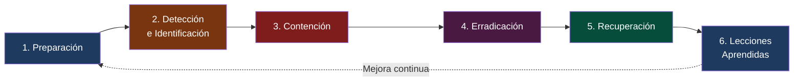
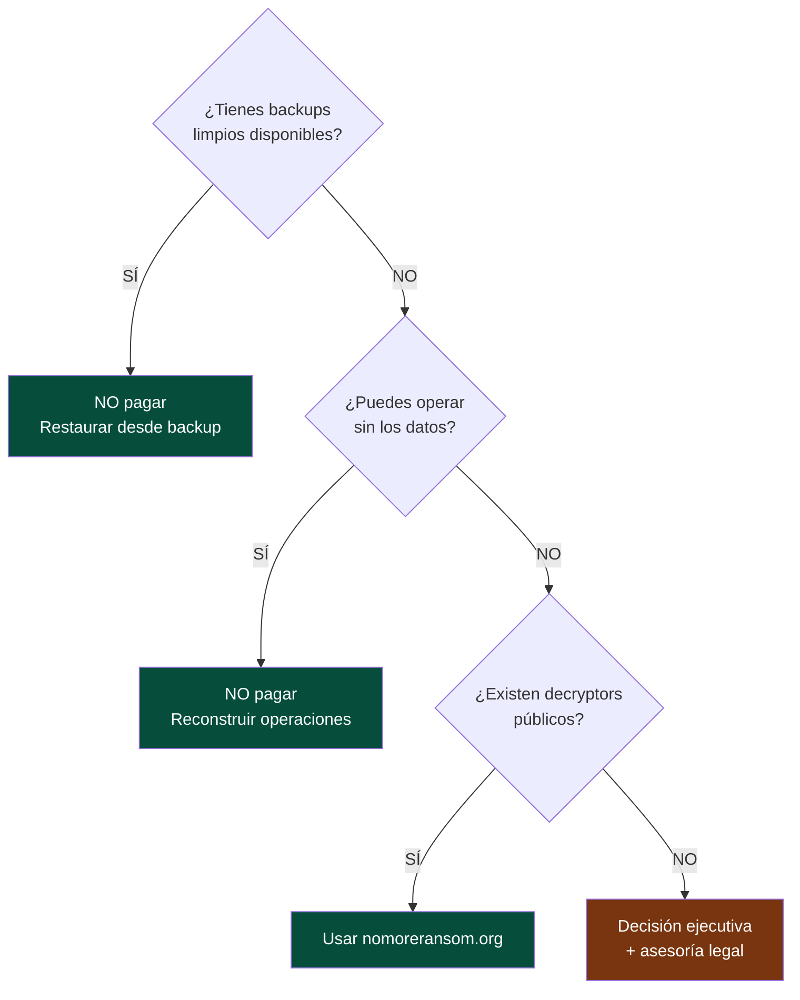

# Ciberseguridad para la Industria Manufacturera

## Día 4 — Respuesta a Incidentes y Ransomware

**INDEX Ciudad Juárez · 27 de marzo de 2026**

<div class="pt-6 text-gray-400">
  4 horas · Sesión 4 de 4 · Proyecto Final
</div>

---
layout: quote
---

# "No es cuestión de si serás atacado, sino de cuándo."

**Robert Mueller — Ex Director del FBI**

<!--
El objetivo de hoy no es evitar el ataque. Es sobrevivir a él.
-->

---
layout: two-cols
---

# Recap — Días 1, 2 y 3

**Día 1:** Phishing con IA · BEC · Deepfakes · Cadena de suministro

**Día 2:** MFA · Privilegio mínimo · Zero Trust · Credenciales

**Día 3:** M365 inseguro · Convergencia IT/OT · Protocolos industriales

**Métricas aprendidas:**
- Phishing Click Rate → **< 5%**
- MFA Coverage (admins) → **100%**
- Data Exposure Index → **0 archivos públicos**
- Asset Inventory → **100%**
- Patch Compliance → **< 72 horas**

::right::

# Agenda — Día 4

| Bloque | Tema |
|--------|------|
| 🎯 Bloque 1 | Respuesta a incidentes |
| 🔬 Lab 7 | Simulación de ransomware |
| 🎭 Lab 8 | Análisis de logs (Blue Team Labs) |
| 🏆 Proyecto | Simulación completa final |

---
layout: section
---

# Bloque 1
## Respuesta a incidentes en manufactura

---
layout: fact
background: /images/factory-stopped.jpg
---

# $340,000 USD

## Costo de 18 horas de producción detenida por ransomware

*Planta aeroespacial en Juárez — vector de entrada: red IT/OT sin segmentación*

---

# El costo real de un incidente en maquiladora

| Tipo de pérdida | Ejemplo | Costo estimado |
|----------------|---------|----------------|
| **Producción detenida** | Línea de ensamble parada 24h | $50,000–$500,000 USD |
| **Penalizaciones del cliente** | Ford cobra por entrega tardía | Hasta 3× el valor del pedido |
| **Recuperación de sistemas** | IT externo, nuevos equipos | $20,000–$200,000 USD |
| **Investigación forense** | Empresa especializada en IR | $15,000–$80,000 USD |
| **Pérdida de contrato** | Riesgo de perder al cliente | Millones en ingresos anuales |

<v-click>

> **Caso documentado:** Planta electrónica en Juárez (2023) — Ransomware por phishing · 72 horas de producción parada · **$1.2 millones USD** de pérdida total.

</v-click>

---

# Las 6 fases de respuesta — NIST SP 800-61



---

# Fase 1 — Preparación (antes del ataque)

**Lo que debe existir ANTES de que ocurra el incidente:**

<v-clicks>

- [ ] Plan de Respuesta a Incidentes (IRP) documentado y aprobado
- [ ] Equipo de respuesta definido con roles y contactos 24/7
- [ ] Herramientas disponibles: EDR, SIEM, backups verificados
- [ ] Acuerdo con proveedor externo de IR (Incident Response)
- [ ] Ejercicios de simulación al menos una vez al año

</v-clicks>

<v-click>

| Rol | Responsabilidad | Quién en planta |
|-----|----------------|-----------------|
| Coordinador de IR | Dirige la respuesta | Gerente de IT / CISO |
| Técnico de sistemas | Aísla sistemas, preserva evidencia | Admin de red |
| Enlace con negocio | Coordina impacto con producción | Gerente de planta |
| Enlace legal/RRHH | Comunicación y compliance | Director RRHH |

</v-click>

---

# Fase 2 — Detección: IoCs en manufactura


**Indicadores de Compromiso más comunes en planta:**

<v-clicks>

**En la red:**
- Tráfico masivo a IPs externas en horarios nocturnos
- DNS queries a dominios recién registrados
- Conexiones a países sin operaciones de la empresa

**En endpoints:**
- Proceso desconocido consumiendo alta CPU/disco
- Archivos con extensión cambiada: `.locked`, `.encrypted`, `.RYUK`
- Nuevas cuentas de administrador creadas sin ticket

**Reportado por usuarios:**
- "Mi equipo está lento y hay archivos que no puedo abrir"
- Correo del CEO pidiendo algo inusual
- Acceso desde ubicación geográfica imposible (ej: Dallas y Mumbai simultáneo)

</v-clicks>

---

# Fase 3 — Contención inmediata

**Primeros 30 minutos — cada minuto cuenta:**

<v-clicks>

```
PRIORIDAD 1: Aislar sistemas afectados
  → Desconectar de la red (cable ethernet + WiFi)
  → NO apagar el equipo (se pierde evidencia en RAM)
  → Bloquear cuenta comprometida en Active Directory

PRIORIDAD 2: Identificar el alcance
  → ¿Cuántos equipos están afectados?
  → ¿Llegó a la red OT / producción?
  → ¿Se exfiltraron datos antes del cifrado?

PRIORIDAD 3: Proteger lo que no está infectado
  → Desconectar servidores de backup de la red
  → Aislar servidores de ERP si hay riesgo
  → Activar modo manual en producción si MES está comprometido
```

</v-clicks>

---

# Decisión crítica — ¿Se para producción?

| Escenario | Decisión recomendada |
|-----------|---------------------|
| Solo afecta PCs de oficina | Continuar producción, aislar red de oficinas |
| Afecta MES pero no PLC | Producción en **modo manual** documentado |
| Afecta PLC / SCADA | **Detener producción** — riesgo de accidentes |
| Afecta sistema de calidad | Detener o inspección 100% manual |

<v-click>

> Esta decisión la toma el **Gerente de Planta + IT juntos**, no IT solo. El impacto de parar producción puede ser enorme, pero continuar con sistemas comprometidos puede ser catastrófico.

</v-click>

---
layout: two-cols
---

# Estándares — Día 4

## NIST Cybersecurity Framework

| Función | Métrica |
|---------|---------|
| **Detect** | MTTD < 24 horas |
| **Respond** | MTTR < 4 horas |
| **Recover** | RTO < 8 horas |

## CIS Controls

| Control | Descripción |
|---------|-------------|
| **17** — Incident Response | Plan y equipo documentado |
| **8** — Log Management | SIEM con logs 90+ días |
| **13** — Network Monitoring | NDR o alertas de tráfico |

::right::

# Métricas de IR

## MTTD — Mean Time to Detect

```
MTTD = Hora de detección
     − Hora de inicio del ataque
```
**Meta:** < **24 horas**
Promedio sin SIEM: **3–6 meses**

## MTTR — Mean Time to Respond

```
MTTR = Hora de contención
     − Hora de detección
```
**Meta:** < **4 horas**

## RTO — Recovery Time Objective

**Meta por sistema:**
- Producción/MES: < 4h
- ERP (SAP): < 8h
- Correo: < 4h

---
layout: section
---

# Lab 7
## Simulación de ransomware

---

# Lab 7 — La nota de rescate

**Empresa:** Componentes Automotrices Juárez S.A. de C.V. · 6:47 AM

<div class="border border-red-500 bg-red-950 rounded p-4 text-sm font-mono my-3">

```
╔══════════════════════════════════════════════════════╗
║           TUS ARCHIVOS HAN SIDO CIFRADOS             ║
║                                                      ║
║  Todos tus documentos y bases de datos han sido      ║
║  cifrados con AES-256.                               ║
║                                                      ║
║  Para recuperar: pagar 85,000 USD en Bitcoin         ║
║  Tienes 72 horas. Después el precio se duplica.      ║
║  Contacto: recovery@onionmail.org                    ║
╚══════════════════════════════════════════════════════╝
```

</div>

```
Finanzas/presupuesto_2026.xlsx.LOCKED
Ingenieria/planos_arneses_F150.dwg.LOCKED
MES/ordenes_produccion_semana12.db.LOCKED
```

---

# Lab 7 — Respuesta estructurada

**El equipo responde como si fuera una situación real:**

<v-clicks>

**Fase 1 — Primeros 10 min: Contención**
1. ¿Qué sistemas se aíslan primero?
2. ¿Se detiene la línea de producción?
3. ¿A quién se notifica y en qué orden?
4. ¿Se apaga el servidor afectado? ¿Por qué sí o no?

**Fase 2 — Min 10–30: Alcance**
1. ¿Cuántos equipos están cifrados?
2. ¿Llegó al servidor del MES?
3. ¿Los backups están accesibles o también cifrados?
4. ¿Cuándo fue el último backup limpio?

**Fase 3 — Min 30–60: Recuperación y comunicación**
1. Plan de restauración en orden de prioridad
2. ¿Se notifica al cliente (Delphi, GM)?
3. ¿Se paga el rescate?

</v-clicks>

---

# Lab 7 — ¿Se paga el rescate?



> **Pagar no garantiza la recuperación de los datos.** Siempre reportar a CERT-MX.

---
layout: section
background: /images/log-analysis.jpg
---

# Lab 8
## Análisis de logs — Blue Team Labs Online

🔗 blueteamlabs.online · Registro gratuito

---

# Lab 8 — Investigar el incidente en logs

**El atacante entró hace 3 semanas. ¿Cómo?**

```text {all|1-2|3|4-5|6-7|8}
09:23:41  jmorales → http://invoice-dhl-mx.tk/track?id=7823
09:24:02  jmorales → DESCARGA: factura.exe (2.3 MB)
09:24:15  ANTIVIRUS: ALERTA - factura.exe - Trojan.Downloader → Cuarentena
09:25:33  jmorales → http://malicious-c2.ru/beacon
09:25:34  FIREWALL: PERMITIDO - 192.168.1.87 → 185.220.101.45:443
09:26:01  jmorales → Acceso lateral: \\fileserver01
09:28:15  SYSTEM (fileserver01) → Nueva cuenta admin: svc_backup2
11:46:00  svc_backup2 → INICIO DE CIFRADO MASIVO
```

<v-click>

**La pregunta clave:** El antivirus detectó y puso en cuarentena el archivo a las 09:24. ¿Por qué el ataque continuó durante 2 horas más?

</v-click>

---

# Lab 8 — Análisis forense

**Completar la línea de tiempo del ataque:**

| Hora | Actividad | Táctica MITRE | Técnica |
|------|-----------|---------------|---------|
| 09:23 | Clic en phishing | Initial Access | T1566.001 |
| 09:24 | Descarga malware | Execution | T1204.002 |
| 09:25 | Conexión a C2 | Command & Control | T1071 |
| 09:26 | Acceso a fileserver | Lateral Movement | T1021.002 |
| 09:28 | Nueva cuenta admin | Persistence | T1136.001 |
| 11:45 | Login externo | — | — |
| 11:46 | Ransomware activo | Impact | T1486 |

<v-click>

**El antivirus detuvo el ejecutable pero no detectó la conexión al C2 ya activa en memoria.**
→ Esto demuestra por qué el EDR (detección por comportamiento) es superior al antivirus tradicional.

</v-click>

---
layout: section
---

# Proyecto Final del Curso
## Simulación completa — Aztec Electronics Manufacturing

---

# El escenario

**Aztec Electronics Manufacturing S.A. de C.V.**
- Manufactura de tableros electrónicos para GM y Stellantis
- Parque Industrial Bermúdez, Ciudad Juárez — 1,200 empleados
- Sistemas: SAP S/4HANA · MES Ignition · Office 365 · PLCs Allen-Bradley

**El ataque se desarrolla en 4 etapas. Los equipos reciben información progresivamente.**

---

# Etapa 1 — Lunes 8:15 AM

<div class="border border-yellow-500 bg-yellow-950 rounded p-4 text-sm my-3">

**Correo recibido por el Jefe de Compras:**

De: `proveedores@gm-supply-mx.com`

*"Adjunto nueva lista de precios y contrato para Q2-2026. Favor revisar y firmar digitalmente."*

📎 `Contrato_GM_Q2_2026.pdf.exe`

</div>

**Preguntas de la Etapa 1:**

<v-clicks>

1. ¿Es este correo legítimo? ¿Qué señales lo indican?
2. ¿El jefe de compras debería abrir el adjunto?
3. ¿Qué debe hacer en su lugar?
4. ¿Quién debe ser notificado antes de tomar cualquier acción?

</v-clicks>

---

# Etapa 2 — Lunes 8:47 AM

**El jefe de compras abrió el adjunto. El antivirus no detectó nada.**
**9:00 AM — Helpdesk recibe reporte: "Mi equipo está lento"**

<v-clicks>

**¿Qué está pasando?**
- El malware se instaló y está estableciendo conexión con el servidor C2
- El antivirus no lo detecta porque es una variante nueva (0-day)
- Cada minuto que pasa, el atacante gana acceso más profundo

**Acciones inmediatas del helpdesk:**
1. ¿Desconectar el equipo de la red? ¿Cómo (sin apagarlo)?
2. ¿A quién se notifica de inmediato?
3. ¿Se continúa el turno con normalidad o se activa el IRP?
4. ¿Se preserva evidencia o se formatea el equipo ya?

</v-clicks>

---

# Etapa 3 — Lunes 11:30 AM

**El atacante tiene acceso a SAP con las credenciales del jefe de compras.**

**En las últimas 2 horas realizó:**

<v-clicks>

- Consulta de **847 órdenes de compra** activas
- Descarga de lista completa de proveedores con datos bancarios
- Intento (fallido por MFA) de modificar transferencia de **$220,000 USD**

**¿Qué hacer ahora?**
1. Bloquear acceso a SAP del usuario comprometido
2. ¿Se anulan las 847 órdenes de compra activas?
3. ¿Se notifica a los proveedores sobre el riesgo de cambio de datos?
4. ¿Qué controles habrían prevenido el acceso a SAP?

</v-clicks>

<v-click>

> El MFA bloqueó la transferencia de $220K. **Eso pagó el costo del curso completo.**

</v-click>

---

# Etapa 4 — Lunes 3:00 PM

**El atacante escaló a administrador de dominio.**
**Se detecta movimiento lateral hacia el servidor del MES.**
**La pantalla HMI del Turno 2 muestra datos incorrectos.**

<v-clicks>

**Decisión crítica:**

¿Se detiene la producción?

- 600 operadores en 3 líneas activas
- Cliente GM espera entrega mañana temprano
- El HMI muestra datos incorrectos — riesgo de defectos en producción

**Respuesta correcta:** Se detiene la producción de las líneas afectadas.
Un tablero electrónico defectuoso en un automóvil es un riesgo de seguridad físico.
El costo de una demanda por defecto supera el costo de detener producción 4 horas.

</v-clicks>

---

# Entregables del Proyecto Final

**Cada equipo entrega:**

<v-clicks>

1. **Matriz MITRE ATT&CK** — Tácticas y técnicas en cada etapa del ataque

2. **Controles CIS** — Para cada técnica: ¿qué control lo hubiera prevenido?

3. **Plan de respuesta ejecutado** — Línea de tiempo, decisiones tomadas, justificación

4. **Reporte post-mortem** — 1 página para presentar a la dirección de la planta:
   - ¿Qué pasó? ¿Qué datos se comprometieron?
   - ¿Qué se hizo para contener?
   - ¿Qué cambios se implementarán?

5. **Presentación ejecutiva** — 5 minutos:
   - 3 controles prioritarios que hubieran prevenido el ataque
   - Inversión estimada vs costo del incidente

</v-clicks>

---

# Evaluación final del curso

| Criterio | Peso |
|----------|------|
| Desempeño en laboratorios (Labs 1–8) | 30% |
| Análisis MITRE ATT&CK del proyecto | 20% |
| Diseño de controles CIS | 20% |
| Plan de respuesta a incidentes | 20% |
| Presentación ejecutiva | 10% |

<v-click>

**Recursos para continuar:**

| Plataforma | URL | Para qué |
|-----------|-----|---------|
| TryHackMe | tryhackme.com | Ruta: SOC Level 1 |
| Blue Team Labs | blueteamlabs.online | Análisis de logs |
| CERT-MX | gob.mx/cert | Alertas para México |
| MITRE ATT&CK ICS | attack.mitre.org/matrices/ics | OT específico |

</v-click>

---
layout: two-cols-header
---

# Conclusiones del Curso

::left::

## Lo que ahora puedes hacer

<v-clicks>

- Identificar phishing con IA, deepfakes y ataques BEC
- Aplicar MITRE, CIS, NIST, ISO 27001, IEC 62443 en tu planta
- Usar métricas para comunicar el nivel de seguridad a la dirección
- Proteger sistemas OT/IT con Zero Trust y segmentación
- Responder a incidentes de ransomware con proceso estructurado

</v-clicks>

::right::

## Los 5 controles más importantes

<v-clicks>

1. 🔐 **MFA** en VPN, correo y ERP
2. 🎣 **Simulaciones de phishing** mensuales
3. 🔒 **Segmentación** entre red de oficinas y red de producción
4. 💾 **Backups** verificados, offline, probados mensualmente
5. 📋 **Plan de respuesta** documentado y practicado

</v-clicks>

---
layout: end
---

# ¡Gracias!

## Ciberseguridad para la Industria Manufacturera

**INDEX Ciudad Juárez · 24–27 de marzo de 2026**

---

La seguridad de tu planta depende de las decisiones que tomes **esta semana**.

*No la semana que viene.*

<div class="pt-4 text-gray-400 text-sm">
  INDEX Ciudad Juárez · ciberseguridad@index.org.mx
</div>

<!--
Agradecer la participación. Recordar que el primer control que deben implementar es el que más daño hubiera evitado en los casos que vieron esta semana.
-->
